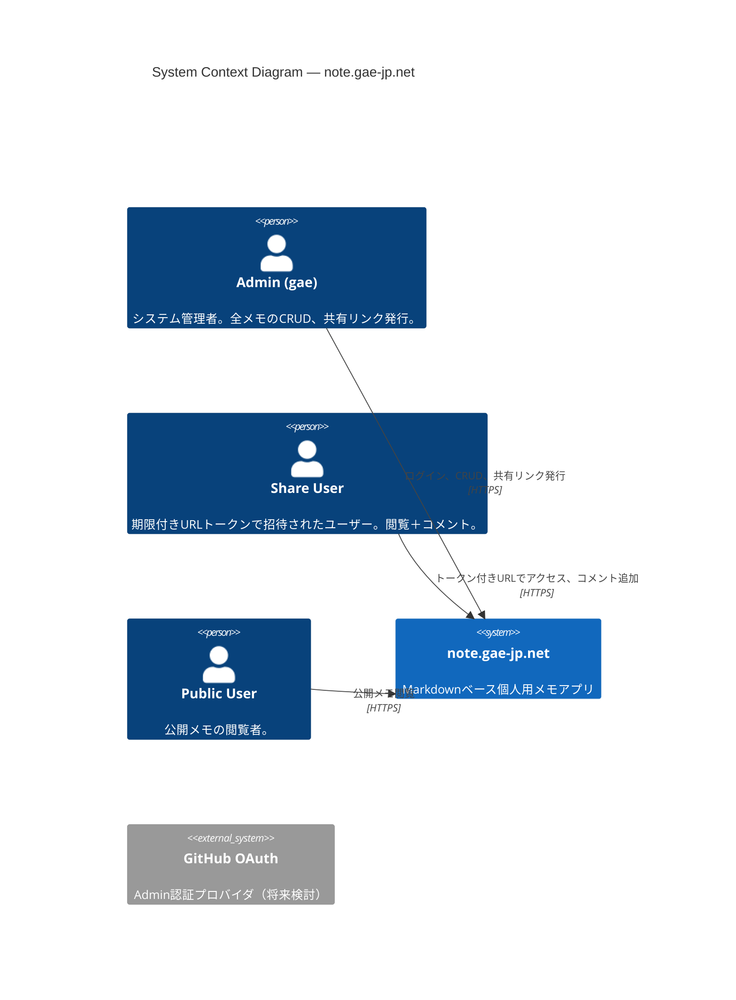
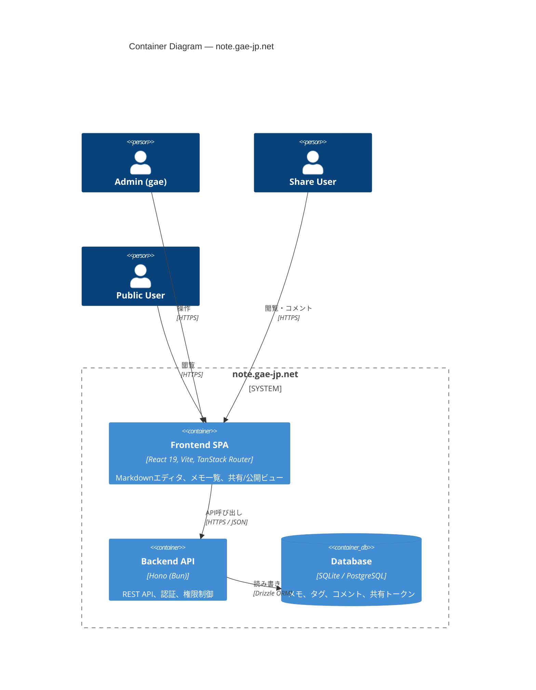
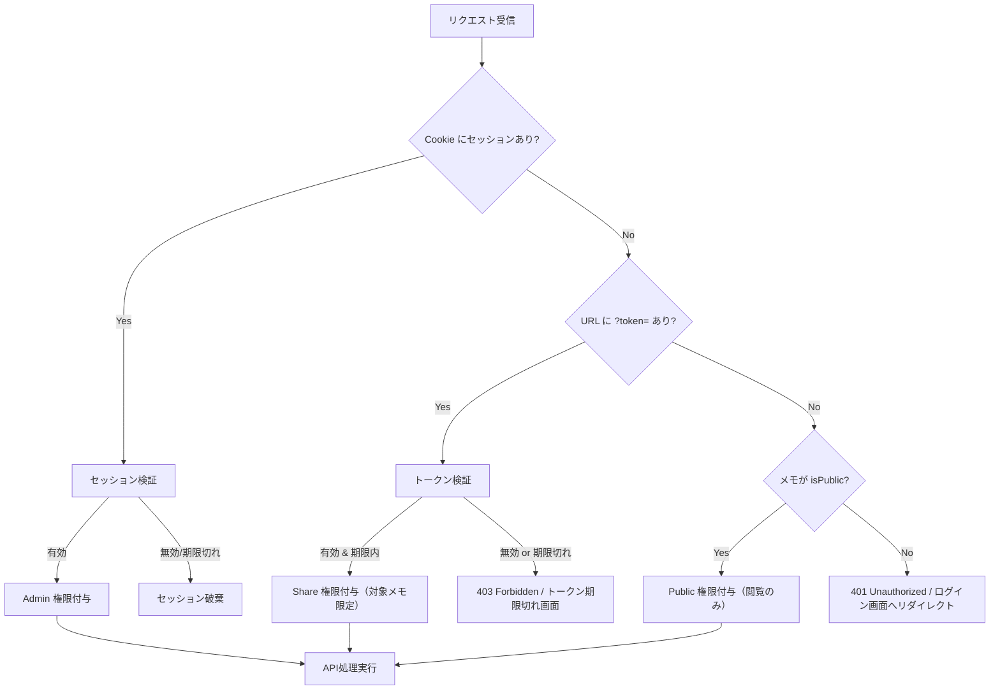
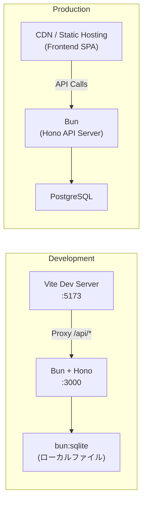

# 01. System Architecture

<thinking_process>

## 要件の矛盾確認

- Admin（gae のみ）/ Share（期限付きトークン）/ Public（一般公開）の3層権限は明確に分離可能。矛盾なし。
- Share ユーザーは「コメント追加のみ可」で「本文編集不可」。この制約は API ミドルウェアで強制する。
- Public は閲覧専用。認証不要だが、メモ側に `isPublic` フラグが必要。

## アーキテクチャの方向性

- **モノレポ構成**（Frontend + Backend）を採用し、KISS 原則に沿って最小構成とする。
- Backend は Hono（Web Standards API）を使い、REST API を提供。セッションベース認証（Admin のみ）。
- Frontend は React 19 + Vite + TanStack Router でSPA構成。
- DB は SQLite（開発）/ PostgreSQL（本番想定）の RDBMS を Drizzle ORM で抽象化。
- YAGNI に従い、WebSocket によるリアルタイム同期は初期スコープ外。プレビューはクライアントサイドで完結する。

## デザインシステムのコンセプト

- gae-jp.net の "Void Kinetic 2026" を継承： 漆黒の背景 `#0a0a0a` ＋ ライムグリーンアクセント `#c8ff00`。
- VSCode 的な「没入型エディタ」体験を目指し、サイドバー＋メインエディタ＋プレビューの3ペインレイアウト。
- Tailwind CSS v4 の `@theme` ブロックでデザイントークンを一元管理（SSOT）。

</thinking_process>

---

## 1.1 プロジェクト概要

HackMD ライクなリアルタイムレンダリング対応 Markdown ベースの**個人用メモアプリケーション**。
管理者 `gae` 専用のフルスタックWebアプリケーションとして設計し、共有・公開機能を限定的に提供する。

### 設計原則

| 原則                   | 適用方針                                                                        |
| ---------------------- | ------------------------------------------------------------------------------- |
| **KISS**               | 最小限のインフラ構成。Backend は Hono 単体、Frontend は Vite + React SPA。      |
| **YAGNI**              | リアルタイム同期（WebSocket）は初期スコープ外。プレビューはクライアントで完結。 |
| **SSOT**               | デザイントークンは `@theme` に、データスキーマは Drizzle スキーマに集約。       |
| **Clean Architecture** | Feature Sliced Design を基にした、層と機能の明確な分離。                        |

---

## 1.2 システム全体俯瞰図（C4 Model — Context）

---

## 1.3 システム全体俯瞰図（C4 Model — Container）

---

## 1.4 技術スタック選定理由

### Frontend

| 技術                          | バージョン | 選定理由                                                                                 |
| ----------------------------- | ---------- | ---------------------------------------------------------------------------------------- |
| **React**                     | 19         | Server Components 対応、`use()` フックによる非同期データの簡素化。エコシステムの成熟度。 |
| **Vite**                      | 6.x        | 高速な HMR、ESM ネイティブ対応。React 19 との親和性。                                    |
| **TanStack Router**           | latest     | Type-safe ルーティング、ファイルベースルート。React 19 に最適化。                        |
| **TanStack Query**            | v5         | サーバー状態管理の標準。キャッシュ・楽観的更新が容易。                                   |
| **Tailwind CSS**              | v4         | CSS 変数によるテーマ管理、`@theme` ブロック。gae-jp.net のデザインシステムを踏襲。       |
| **CodeMirror 6**              | latest     | 軽量・拡張可能なコードエディタ。Markdown モード対応。VSCode ライクな編集体験。           |
| **unified / remark / rehype** | latest     | Markdown → HTML 変換パイプライン。プラグインによる拡張性。                               |

### Backend

| 技術                               | バージョン | 選定理由                                                                                              |
| ---------------------------------- | ---------- | ----------------------------------------------------------------------------------------------------- |
| **bun**                            | latest     | ランタイム + パッケージマネージャ + テストランナーを統一。`bun:sqlite` ビルトイン。高速な起動・実行。 |
| **Hono**                           | v4         | Web Standards API 準拠。`Bun.serve()` と直接統合可能。ミドルウェアチェーンが直感的。                  |
| **Drizzle ORM**                    | latest     | TypeScript-first。スキーマがそのまま型定義。SQL に近い記法で学習コスト低。                            |
| **bun:sqlite / PostgreSQL driver** | —          | 開発時は `bun:sqlite`（ネイティブバインディング不要）、本番は PostgreSQL。Drizzle で切り替え容易。    |
| **Bun.password**                   | —          | Admin パスワードハッシュ。bun ビルトインの argon2必須。                                               |
| **nanoid**                         | —          | 共有トークンの推測不可能な ID 生成。                                                                  |

### 共通

| 技術               | 選定理由                                                                                  |
| ------------------ | ----------------------------------------------------------------------------------------- |
| **TypeScript**     | フロント・バック間の型共有。SSOT としてのスキーマ活用。                                   |
| **Zod**            | バリデーションスキーマ。API 入力検証 ＋ フロントフォームバリデーション。                  |
| **bun workspaces** | `package.json` の `"workspaces"` フィールドでモノレポ管理。専用設定ファイル不要（KISS）。 |

---

## 1.5 認証・認可アーキテクチャ

### 権限マトリクス

| 操作             |    Admin    |       Share       |      Public       |
| ---------------- | :---------: | :---------------: | :---------------: |
| メモ作成         |     ✅      |        ❌         |        ❌         |
| メモ閲覧         | ✅ (全メモ) | ✅ (対象メモのみ) | ✅ (公開メモのみ) |
| メモ編集         |     ✅      |        ❌         |        ❌         |
| メモ削除         |     ✅      |        ❌         |        ❌         |
| コメント追加     |     ✅      | ✅ (対象メモのみ) |        ❌         |
| コメント削除     |     ✅      |        ❌         |        ❌         |
| 共有トークン発行 |     ✅      |        ❌         |        ❌         |
| 公開設定変更     |     ✅      |        ❌         |        ❌         |
| タグ管理         |     ✅      |        ❌         |        ❌         |
| 全文検索         |     ✅      |        ❌         |        ❌         |

---

## 1.6 デプロイメント概念図

---

## 1.7 セキュリティ設計方針

| 項目               | 対策                                                                             |
| ------------------ | -------------------------------------------------------------------------------- |
| **Admin 認証**     | パスワードベース認証 + HttpOnly/Secure/SameSite Cookie によるセッション管理      |
| **セッション**     | サーバーサイドセッションストア（DB）。有効期限付き。CSRF トークン検証。          |
| **Share トークン** | `nanoid(32)` による推測不可能な文字列。DB に有効期限を記録し、毎リクエスト検証。 |
| **入力検証**       | 全 API エンドポイントで Zod によるスキーマバリデーション。                       |
| **XSS 対策**       | Markdown レンダリング時の HTML サニタイズ（rehype-sanitize）。                   |
| **CORS**           | 本番環境では許可オリジンを明示的に制限。                                         |
| **レート制限**     | 認証エンドポイントに対するレート制限ミドルウェア。                               |
