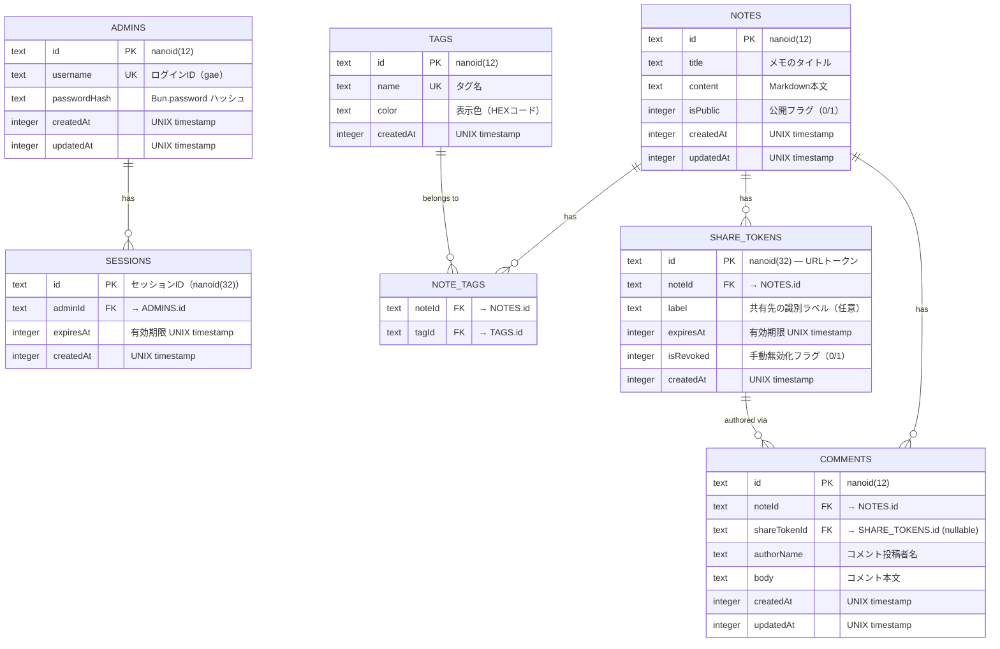

# 02. Database Schema

## 2.1 設計方針

- **Drizzle ORM** による TypeScript-first なスキーマ定義。型定義とスキーマが SSOT。
- RDBMS 前提。開発環境は **SQLite**、本番環境は **PostgreSQL** を想定。
- **正規化**を基本とし、パフォーマンスが必要な箇所のみ非正規化を検討（YAGNI）。
- タイムスタンプは全テーブルに `createdAt` / `updatedAt` を付与。

---

## 2.2 ER 図



---

## 2.3 テーブル定義詳細

### `admins` — 管理者テーブル

| カラム         | 型        | 制約              | 説明                                                 |
| -------------- | --------- | ----------------- | ---------------------------------------------------- |
| `id`           | `text`    | PK                | `nanoid(12)` で生成                                  |
| `username`     | `text`    | UNIQUE, NOT NULL  | ログイン ID。初期値 `gae`                            |
| `passwordHash` | `text`    | NOT NULL          | `Bun.password.hash()` によるハッシュ値（argon2必須） |
| `createdAt`    | `integer` | NOT NULL, DEFAULT | 作成日時（UNIX ms）                                  |
| `updatedAt`    | `integer` | NOT NULL, DEFAULT | 更新日時（UNIX ms）                                  |

> [!NOTE]
> `admins` テーブルは現在 `gae` 1ユーザーのみを想定しているが、将来の拡張を最小限の変更で対応できるよう、テーブルとして設計。YAGNI に反しない最小限の余地。

---

### `sessions` — セッションテーブル

| カラム      | 型        | 制約                     | 説明                                          |
| ----------- | --------- | ------------------------ | --------------------------------------------- |
| `id`        | `text`    | PK                       | `nanoid(32)` で生成。HttpOnly Cookie に格納。 |
| `adminId`   | `text`    | FK → admins.id, NOT NULL | セッション所有者                              |
| `expiresAt` | `integer` | NOT NULL                 | 有効期限（UNIX ms）。デフォルト 7日間。       |
| `createdAt` | `integer` | NOT NULL, DEFAULT        | 作成日時                                      |

**仕様:**

- ログイン成功時にセッションレコードを生成し、`id` を `Set-Cookie` で返却。
- 毎リクエスト時に `expiresAt` を検証。期限切れのセッションはバッチ or リクエスト時に削除。
- ログアウト時はセッションレコードを削除。

---

### `notes` — メモテーブル

| カラム      | 型        | 制約                   | 説明                         |
| ----------- | --------- | ---------------------- | ---------------------------- |
| `id`        | `text`    | PK                     | `nanoid(12)` で生成          |
| `title`     | `text`    | NOT NULL, DEFAULT `''` | メモタイトル。空文字列許容。 |
| `content`   | `text`    | NOT NULL, DEFAULT `''` | Markdown 本文                |
| `isPublic`  | `integer` | NOT NULL, DEFAULT `0`  | `0` = 非公開, `1` = 公開     |
| `createdAt` | `integer` | NOT NULL, DEFAULT      | 作成日時                     |
| `updatedAt` | `integer` | NOT NULL, DEFAULT      | 更新日時                     |

**インデックス:**

- `idx_notes_is_public` on `(isPublic)` — 公開メモの一覧取得高速化
- `idx_notes_created_at` on `(createdAt DESC)` — 最新順ソートの高速化

**全文検索:**

- SQLite: `FTS5` 仮想テーブル（`notes_fts`）を `title` + `content` に対して作成
- PostgreSQL: `tsvector` カラム + GIN インデックス

---

### `tags` — タグテーブル

| カラム      | 型        | 制約                          | 説明                                   |
| ----------- | --------- | ----------------------------- | -------------------------------------- |
| `id`        | `text`    | PK                            | `nanoid(12)`                           |
| `name`      | `text`    | UNIQUE, NOT NULL              | タグ名（例: `tech`, `diary`）          |
| `color`     | `text`    | NOT NULL, DEFAULT `'#c8ff00'` | 表示色。デフォルトはアクセントカラー。 |
| `createdAt` | `integer` | NOT NULL, DEFAULT             | 作成日時                               |

---

### `note_tags` — メモ×タグ 中間テーブル

| カラム   | 型     | 制約                    | 説明 |
| -------- | ------ | ----------------------- | ---- |
| `noteId` | `text` | FK → notes.id, NOT NULL |      |
| `tagId`  | `text` | FK → tags.id, NOT NULL  |      |

- **複合主キー:** `(noteId, tagId)`
- **CASCADE:** メモ or タグ削除時に中間レコードも削除

---

### `share_tokens` — 共有トークンテーブル

| カラム      | 型        | 制約                    | 説明                                                |
| ----------- | --------- | ----------------------- | --------------------------------------------------- |
| `id`        | `text`    | PK                      | `nanoid(32)` — URL トークンとして使用。推測不可能。 |
| `noteId`    | `text`    | FK → notes.id, NOT NULL | 共有対象のメモ                                      |
| `label`     | `text`    | DEFAULT `NULL`          | 共有先の識別ラベル（例: `"田中さん"`, `"チームA"`） |
| `expiresAt` | `integer` | NOT NULL                | 有効期限（UNIX ms）                                 |
| `isRevoked` | `integer` | NOT NULL, DEFAULT `0`   | `0` = 有効, `1` = 手動無効化済み                    |
| `createdAt` | `integer` | NOT NULL, DEFAULT       | 発行日時                                            |

> [!IMPORTANT]
> **トークンの安全性:** `nanoid(32)` は 32文字（アルファベット大小＋数字、62種）で構成され、約 190 bit のエントロピーを持つ。ブルートフォースによる推測は現実的に不可能。

**仕様:**

- Admin がメモ詳細画面から「共有リンクを発行」すると、新しい `share_tokens` レコードを作成。
- 有効期限はデフォルト **7日間**（Admin が変更可能: 1時間, 1日, 7日, 30日, カスタム）。
- `isRevoked = 1` にすることで、期限前でも即座に無効化可能。
- 共有 URL 形式: `https://note.gae-jp.net/s/{token}`

**検証ロジック:**

```
isValid = token.expiresAt > Date.now() && token.isRevoked === 0
```

---

### `comments` — コメントテーブル

| カラム         | 型        | 制約                           | 説明                                                            |
| -------------- | --------- | ------------------------------ | --------------------------------------------------------------- |
| `id`           | `text`    | PK                             | `nanoid(12)`                                                    |
| `noteId`       | `text`    | FK → notes.id, NOT NULL        | コメント対象のメモ                                              |
| `shareTokenId` | `text`    | FK → share_tokens.id, NULLABLE | Share ユーザーの場合、使用したトークン。Admin の場合は `NULL`。 |
| `authorName`   | `text`    | NOT NULL                       | 投稿者名（Share ユーザーが入力 or Admin は `gae` 固定）         |
| `body`         | `text`    | NOT NULL                       | コメント本文（プレーンテキスト。Markdown 非対応。KISS 原則。）  |
| `createdAt`    | `integer` | NOT NULL, DEFAULT              | 投稿日時                                                        |
| `updatedAt`    | `integer` | NOT NULL, DEFAULT              | 更新日時                                                        |

**インデックス:**

- `idx_comments_note_id` on `(noteId)` — メモ別コメント取得
- `idx_comments_created_at` on `(createdAt ASC)` — 時系列順表示

---

## 2.4 Drizzle ORM スキーマ定義（TypeScript）

```typescript
// packages/backend/src/db/schema.ts

import {
    sqliteTable,
    text,
    integer,
    primaryKey,
    index,
} from 'drizzle-orm/sqlite-core';

// ── Admins ──────────────────────────────────────────
export const admins = sqliteTable('admins', {
    id: text('id').primaryKey(),
    username: text('username').notNull().unique(),
    passwordHash: text('password_hash').notNull(),
    createdAt: integer('created_at', { mode: 'timestamp_ms' })
        .notNull()
        .defaultNow(),
    updatedAt: integer('updated_at', { mode: 'timestamp_ms' })
        .notNull()
        .defaultNow(),
});

// ── Sessions ────────────────────────────────────────
export const sessions = sqliteTable('sessions', {
    id: text('id').primaryKey(),
    adminId: text('admin_id')
        .notNull()
        .references(() => admins.id, { onDelete: 'cascade' }),
    expiresAt: integer('expires_at', { mode: 'timestamp_ms' }).notNull(),
    createdAt: integer('created_at', { mode: 'timestamp_ms' })
        .notNull()
        .defaultNow(),
});

// ── Notes ───────────────────────────────────────────
export const notes = sqliteTable(
    'notes',
    {
        id: text('id').primaryKey(),
        title: text('title').notNull().default(''),
        content: text('content').notNull().default(''),
        isPublic: integer('is_public').notNull().default(0),
        createdAt: integer('created_at', { mode: 'timestamp_ms' })
            .notNull()
            .defaultNow(),
        updatedAt: integer('updated_at', { mode: 'timestamp_ms' })
            .notNull()
            .defaultNow(),
    },
    (table) => [
        index('idx_notes_is_public').on(table.isPublic),
        index('idx_notes_created_at').on(table.createdAt),
    ],
);

// ── Tags ────────────────────────────────────────────
export const tags = sqliteTable('tags', {
    id: text('id').primaryKey(),
    name: text('name').notNull().unique(),
    color: text('color').notNull().default('#c8ff00'),
    createdAt: integer('created_at', { mode: 'timestamp_ms' })
        .notNull()
        .defaultNow(),
});

// ── Note ↔ Tags (多対多) ────────────────────────────
export const noteTags = sqliteTable(
    'note_tags',
    {
        noteId: text('note_id')
            .notNull()
            .references(() => notes.id, { onDelete: 'cascade' }),
        tagId: text('tag_id')
            .notNull()
            .references(() => tags.id, { onDelete: 'cascade' }),
    },
    (table) => [primaryKey({ columns: [table.noteId, table.tagId] })],
);

// ── Share Tokens ────────────────────────────────────
export const shareTokens = sqliteTable('share_tokens', {
    id: text('id').primaryKey(), // nanoid(32)
    noteId: text('note_id')
        .notNull()
        .references(() => notes.id, { onDelete: 'cascade' }),
    label: text('label'),
    expiresAt: integer('expires_at', { mode: 'timestamp_ms' }).notNull(),
    isRevoked: integer('is_revoked').notNull().default(0),
    createdAt: integer('created_at', { mode: 'timestamp_ms' })
        .notNull()
        .defaultNow(),
});

// ── Comments ────────────────────────────────────────
export const comments = sqliteTable(
    'comments',
    {
        id: text('id').primaryKey(),
        noteId: text('note_id')
            .notNull()
            .references(() => notes.id, { onDelete: 'cascade' }),
        shareTokenId: text('share_token_id').references(() => shareTokens.id, {
            onDelete: 'set null',
        }),
        authorName: text('author_name').notNull(),
        body: text('body').notNull(),
        createdAt: integer('created_at', { mode: 'timestamp_ms' })
            .notNull()
            .defaultNow(),
        updatedAt: integer('updated_at', { mode: 'timestamp_ms' })
            .notNull()
            .defaultNow(),
    },
    (table) => [
        index('idx_comments_note_id').on(table.noteId),
        index('idx_comments_created_at').on(table.createdAt),
    ],
);
```

---

## 2.5 全文検索のデータ構造

### SQLite — FTS5

```sql
-- FTS5 仮想テーブル
CREATE VIRTUAL TABLE notes_fts USING fts5(
  title,
  content,
  content='notes',
  content_rowid='rowid'
);

-- トリガーで同期
CREATE TRIGGER notes_ai AFTER INSERT ON notes BEGIN
  INSERT INTO notes_fts(rowid, title, content) VALUES (new.rowid, new.title, new.content);
END;

CREATE TRIGGER notes_ad AFTER DELETE ON notes BEGIN
  INSERT INTO notes_fts(notes_fts, rowid, title, content) VALUES('delete', old.rowid, old.title, old.content);
END;

CREATE TRIGGER notes_au AFTER UPDATE ON notes BEGIN
  INSERT INTO notes_fts(notes_fts, rowid, title, content) VALUES('delete', old.rowid, old.title, old.content);
  INSERT INTO notes_fts(rowid, title, content) VALUES (new.rowid, new.title, new.content);
END;
```

### PostgreSQL — tsvector + GIN

```sql
-- tsvector カラム追加
ALTER TABLE notes ADD COLUMN search_vector tsvector
  GENERATED ALWAYS AS (
    setweight(to_tsvector('english', coalesce(title, '')), 'A') ||
    setweight(to_tsvector('english', coalesce(content, '')), 'B')
  ) STORED;

-- GIN インデックス
CREATE INDEX idx_notes_search ON notes USING GIN (search_vector);
```

---

## 2.6 データ最適化論理

### Token テーブルの設計判断

| 検討項目               | 決定               | 理由                                                                     |
| ---------------------- | ------------------ | ------------------------------------------------------------------------ |
| トークンの保存場所     | DB テーブル        | 有効期限・無効化の状態管理が必要。JWT は期限前の無効化に不向き。KISS。   |
| トークン長             | 32文字             | 約 190 bit エントロピー。URL 長として許容範囲内。                        |
| 有効期限の管理         | `expiresAt` カラム | 毎リクエスト時比較。シンプルで確実。                                     |
| 無効化方式             | `isRevoked` フラグ | 物理削除ではなく論理削除。監査ログとしての役割も兼ねる。                 |
| 期限切れレコードの削除 | バッチ処理（任意） | 即時削除は不要。参照されなくなった古いレコードを定期的にクリーンアップ。 |

### コメントテーブルの設計判断

| 検討項目                   | 決定                                | 理由                                                                               |
| -------------------------- | ----------------------------------- | ---------------------------------------------------------------------------------- |
| `shareTokenId` の NULLABLE | Share ユーザー → 必須, Admin → NULL | 誰がコメントしたかを追跡するため。Admin のコメントは `authorName = 'gae'` で識別。 |
| コメント本文の形式         | プレーンテキスト                    | KISS。Markdown コメントはこのスコープでは過剰。                                    |
| スレッド/ネスト            | 非対応                              | YAGNI。フラットなコメントリストのみ。                                              |
