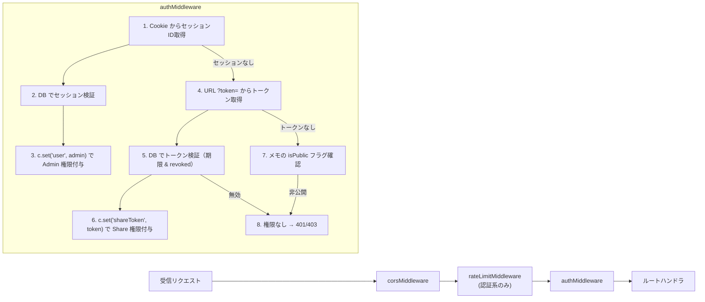
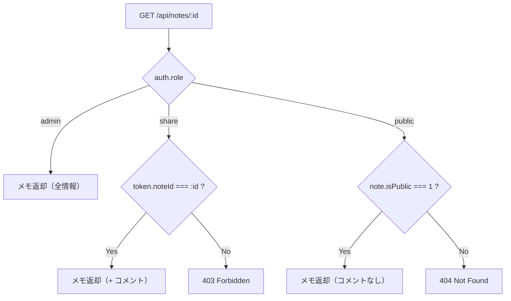

# 03. API Specification

## 3.1 設計方針

- **Hono** のルーティングとミドルウェアチェーンを活用した REST API。
- 全エンドポイントで **Zod** によるリクエストバリデーション。
- レスポンスは統一エンベロープ形式: `{ success: boolean, data?: T, error?: string }`
- コンテンツタイプは `application/json`（例外: ファイルダウンロード系がある場合のみ）

---

## 3.2 Auth ミドルウェア設計

### ミドルウェア構成図



### ミドルウェアのコード概念

```typescript
// packages/backend/src/middleware/auth.ts

type AuthContext = {
  role: 'admin' | 'share' | 'public';
  adminId?: string;
  shareToken?: { id: string; noteId: string };
};

/** 全リクエストに適用。権限情報を c.set('auth', ctx) にセット。 */
export const authMiddleware = () => {
  return createMiddleware(async (c, next) => {
    // 1. セッション認証（Admin）
    const sessionId = getCookie(c, 'session_id');
    if (sessionId) {
      const session = await validateSession(sessionId);
      if (session) {
        c.set('auth', { role: 'admin', adminId: session.adminId });
        return next();
      }
    }

    // 2. トークン認証（Share）
    const token = c.req.query('token');
    if (token) {
      const shareToken = await validateShareToken(token);
      if (shareToken) {
        c.set('auth', { role: 'share', shareToken });
        return next();
      }
      // トークンが無効 or 期限切れ
      return c.json({ success: false, error: 'Token expired or invalid' }, 403);
    }

    // 3. 認証なし → Public（各ルートで isPublic を検証）
    c.set('auth', { role: 'public' });
    return next();
  });
};

/** Admin 限定ルートのガード */
export const requireAdmin = () => {
  return createMiddleware(async (c, next) => {
    const auth = c.get('auth');
    if (auth.role !== 'admin') {
      return c.json({ success: false, error: 'Unauthorized' }, 401);
    }
    return next();
  });
};

/** Admin または Share 限定ルートのガード */
export const requireAuth = () => {
  return createMiddleware(async (c, next) => {
    const auth = c.get('auth');
    if (auth.role === 'public') {
      return c.json({ success: false, error: 'Unauthorized' }, 401);
    }
    return next();
  });
};
```

---

## 3.3 エンドポイント一覧

### 認証 (Auth)

| メソッド | パス               | 権限   | 説明                         |
| -------- | ------------------ | ------ | ---------------------------- |
| `POST`   | `/api/auth/login`  | Public | Admin ログイン               |
| `POST`   | `/api/auth/logout` | Admin  | ログアウト（セッション破棄） |
| `GET`    | `/api/auth/me`     | Admin  | 現在のセッション情報取得     |

---

#### `POST /api/auth/login`

**Request:**

```json
{
  "username": "gae",
  "password": "********"
}
```

**Validation (Zod):**

```typescript
const loginSchema = z.object({
  username: z.string().min(1),
  password: z.string().min(1),
});
```

**Response (200):**

```json
{
  "success": true,
  "data": {
    "user": { "id": "xxxxxxxxxxxx", "username": "gae" }
  }
}
```

**Side Effect:** `Set-Cookie: session_id=...; HttpOnly; Secure; SameSite=Lax; Path=/; Max-Age=604800`

**Response (401):**

```json
{ "success": false, "error": "Invalid credentials" }
```

---

#### `POST /api/auth/logout`

**Request:** なし（Cookie から自動取得）

**Response (200):**

```json
{ "success": true }
```

**Side Effect:** セッションレコード削除、Cookie 破棄

---

#### `GET /api/auth/me`

**Response (200) — ログイン済み:**

```json
{
  "success": true,
  "data": {
    "user": { "id": "xxxxxxxxxxxx", "username": "gae" }
  }
}
```

**Response (401) — 未ログイン:**

```json
{ "success": false, "error": "Not authenticated" }
```

---

### メモ (Notes)

| メソッド | パス                | 権限                   | 説明                                 |
| -------- | ------------------- | ---------------------- | ------------------------------------ |
| `GET`    | `/api/notes`        | Admin                  | メモ一覧取得（検索・フィルタ対応）   |
| `POST`   | `/api/notes`        | Admin                  | メモ新規作成                         |
| `GET`    | `/api/notes/:id`    | Admin / Share / Public | メモ詳細取得                         |
| `PATCH`  | `/api/notes/:id`    | Admin                  | メモ更新（タイトル・本文・公開設定） |
| `DELETE` | `/api/notes/:id`    | Admin                  | メモ削除                             |
| `GET`    | `/api/public/notes` | Public                 | 公開メモ一覧取得                     |

---

#### `GET /api/notes` — メモ一覧

**Query Parameters:**

| パラメータ | 型                       | 必須 | 説明                                  |
| ---------- | ------------------------ | ---- | ------------------------------------- |
| `q`        | `string`                 | No   | 全文検索クエリ                        |
| `tags`     | `string`                 | No   | タグ名のカンマ区切り（AND 検索）      |
| `isPublic` | `0 \| 1`                 | No   | 公開フラグフィルタ                    |
| `sort`     | `createdAt \| updatedAt` | No   | ソート基準（デフォルト: `updatedAt`） |
| `order`    | `asc \| desc`            | No   | ソート順（デフォルト: `desc`）        |
| `page`     | `number`                 | No   | ページ番号（デフォルト: `1`）         |
| `limit`    | `number`                 | No   | 件数（デフォルト: `20`, 最大: `100`） |

**Response (200):**

```json
{
  "success": true,
  "data": {
    "notes": [
      {
        "id": "xxxxxxxxxxxx",
        "title": "My Note Title",
        "content": "# Hello\n\nThis is...",
        "isPublic": 0,
        "tags": [{ "id": "yyyyyyyyyyyy", "name": "tech", "color": "#c8ff00" }],
        "commentCount": 3,
        "createdAt": "2026-02-27T00:00:00.000Z",
        "updatedAt": "2026-02-27T01:00:00.000Z"
      }
    ],
    "pagination": {
      "page": 1,
      "limit": 20,
      "total": 42,
      "totalPages": 3
    }
  }
}
```

---

#### `POST /api/notes` — メモ作成

**Request:**

```json
{
  "title": "New Note",
  "content": "# Hello World",
  "isPublic": false,
  "tagIds": ["tag_id_1", "tag_id_2"]
}
```

**Validation:**

```typescript
const createNoteSchema = z.object({
  title: z.string().max(200).default(''),
  content: z.string().default(''),
  isPublic: z.boolean().default(false),
  tagIds: z.array(z.string()).default([]),
});
```

**Response (201):**

```json
{
  "success": true,
  "data": {
    "note": { "id": "xxxxxxxxxxxx", "title": "New Note", "...": "..." }
  }
}
```

---

#### `GET /api/notes/:id` — メモ詳細

**権限制御ロジック:**



**Response (200):**

```json
{
  "success": true,
  "data": {
    "note": {
      "id": "xxxxxxxxxxxx",
      "title": "My Note",
      "content": "# Hello\n\n...",
      "isPublic": 1,
      "tags": [...],
      "createdAt": "...",
      "updatedAt": "..."
    },
    "comments": [
      {
        "id": "cccccccccccc",
        "authorName": "gae",
        "body": "This is a comment",
        "createdAt": "..."
      }
    ]
  }
}
```

---

#### `PATCH /api/notes/:id` — メモ更新

**Request:**

```json
{
  "title": "Updated Title",
  "content": "# Updated Content",
  "isPublic": true,
  "tagIds": ["tag_id_1"]
}
```

**Validation:**

```typescript
const updateNoteSchema = z.object({
  title: z.string().max(200).optional(),
  content: z.string().optional(),
  isPublic: z.boolean().optional(),
  tagIds: z.array(z.string()).optional(),
});
```

**Response (200):**

```json
{ "success": true, "data": { "note": { "...": "..." } } }
```

---

#### `DELETE /api/notes/:id` — メモ削除

**Response (200):**

```json
{ "success": true }
```

> [!NOTE]
> CASCADE により、関連する `note_tags`, `share_tokens`, `comments` も自動削除。

---

### タグ (Tags)

| メソッド | パス            | 権限  | 説明         |
| -------- | --------------- | ----- | ------------ |
| `GET`    | `/api/tags`     | Admin | タグ一覧取得 |
| `POST`   | `/api/tags`     | Admin | タグ作成     |
| `PATCH`  | `/api/tags/:id` | Admin | タグ更新     |
| `DELETE` | `/api/tags/:id` | Admin | タグ削除     |

---

#### `GET /api/tags`

**Response (200):**

```json
{
  "success": true,
  "data": {
    "tags": [
      {
        "id": "tttttttttttt",
        "name": "tech",
        "color": "#c8ff00",
        "noteCount": 12
      }
    ]
  }
}
```

---

#### `POST /api/tags`

**Request:**

```json
{ "name": "design", "color": "#ff6b6b" }
```

**Validation:**

```typescript
const createTagSchema = z.object({
  name: z.string().min(1).max(50),
  color: z
    .string()
    .regex(/^#[0-9a-fA-F]{6}$/)
    .default('#c8ff00'),
});
```

---

### 共有トークン (Share Tokens)

| メソッド | パス                        | 権限  | 説明                       |
| -------- | --------------------------- | ----- | -------------------------- |
| `GET`    | `/api/notes/:noteId/tokens` | Admin | メモの共有トークン一覧     |
| `POST`   | `/api/notes/:noteId/tokens` | Admin | 共有トークン発行           |
| `DELETE` | `/api/tokens/:id`           | Admin | トークン無効化（論理削除） |

---

#### `POST /api/notes/:noteId/tokens` — トークン発行

**Request:**

```json
{
  "label": "田中さん用",
  "expiresIn": "7d"
}
```

**Validation:**

```typescript
const createTokenSchema = z.object({
  label: z.string().max(100).optional(),
  expiresIn: z.enum(['1h', '1d', '7d', '30d']).default('7d'),
});
```

**Response (201):**

```json
{
  "success": true,
  "data": {
    "token": {
      "id": "xxxxxxxxxxxxxxxxxxxxxxxxxxxxxxxx",
      "noteId": "xxxxxxxxxxxx",
      "label": "田中さん用",
      "expiresAt": "2026-03-06T01:30:00.000Z",
      "shareUrl": "https://note.gae-jp.net/s/xxxxxxxxxxxxxxxxxxxxxxxxxxxxxxxx"
    }
  }
}
```

> [!IMPORTANT]
> `shareUrl` はレスポンスでのみ組み立てて返却。DB にはトークン ID のみ保存。

---

#### `DELETE /api/tokens/:id` — トークン無効化

**処理:** `isRevoked = 1` に更新（物理削除ではない）

**Response (200):**

```json
{ "success": true }
```

---

### コメント (Comments)

| メソッド | パス                          | 権限          | 説明             |
| -------- | ----------------------------- | ------------- | ---------------- |
| `GET`    | `/api/notes/:noteId/comments` | Admin / Share | コメント一覧取得 |
| `POST`   | `/api/notes/:noteId/comments` | Admin / Share | コメント追加     |
| `DELETE` | `/api/comments/:id`           | Admin         | コメント削除     |

---

#### `POST /api/notes/:noteId/comments` — コメント追加

**Request:**

```json
{
  "authorName": "田中太郎",
  "body": "このセクションについて質問があります。"
}
```

**Validation:**

```typescript
const createCommentSchema = z.object({
  authorName: z.string().min(1).max(50),
  body: z.string().min(1).max(2000),
});
```

**権限制御:**

- **Admin:** `authorName` は自動的に `"gae"` にオーバーライド。`shareTokenId` は `NULL`。
- **Share:** `shareTokenId` がリクエストの認証トークンから自動セット。`authorName` はリクエスト値を使用。

**Response (201):**

```json
{
  "success": true,
  "data": {
    "comment": {
      "id": "cccccccccccc",
      "noteId": "xxxxxxxxxxxx",
      "authorName": "田中太郎",
      "body": "このセクションについて質問があります。",
      "createdAt": "2026-02-27T01:30:00.000Z"
    }
  }
}
```

---

### 公開メモ (Public Notes)

| メソッド | パス                    | 権限   | 説明         |
| -------- | ----------------------- | ------ | ------------ |
| `GET`    | `/api/public/notes`     | Public | 公開メモ一覧 |
| `GET`    | `/api/public/notes/:id` | Public | 公開メモ詳細 |

---

#### `GET /api/public/notes`

**Query Parameters:** `page`, `limit` のみ

**Response (200):**

```json
{
  "success": true,
  "data": {
    "notes": [
      {
        "id": "xxxxxxxxxxxx",
        "title": "Public Note",
        "tags": [...],
        "createdAt": "...",
        "updatedAt": "..."
      }
    ],
    "pagination": { "..." : "..." }
  }
}
```

> [!NOTE]
> 公開メモ一覧では `content` は含めない（リスト表示の軽量化）。

---

## 3.4 エラーレスポンス仕様

| HTTP Status | 用途                    | レスポンス例                                                           |
| ----------- | ----------------------- | ---------------------------------------------------------------------- |
| `400`       | バリデーションエラー    | `{ "success": false, "error": "Validation failed", "details": [...] }` |
| `401`       | 未認証                  | `{ "success": false, "error": "Not authenticated" }`                   |
| `403`       | 権限不足 / トークン無効 | `{ "success": false, "error": "Token expired or invalid" }`            |
| `404`       | リソース未検出          | `{ "success": false, "error": "Note not found" }`                      |
| `409`       | 競合（重複タグ名等）    | `{ "success": false, "error": "Tag already exists" }`                  |
| `429`       | レート制限超過          | `{ "success": false, "error": "Too many requests" }`                   |
| `500`       | 内部エラー              | `{ "success": false, "error": "Internal server error" }`               |

---

## 3.5 Hono ルーティング構成

```typescript
// packages/backend/src/index.ts

const app = new Hono()
  .use('*', corsMiddleware())
  .use('*', authMiddleware())

  // Auth
  .post('/api/auth/login', loginHandler)
  .post('/api/auth/logout', requireAdmin(), logoutHandler)
  .get('/api/auth/me', requireAdmin(), meHandler)

  // Notes (Admin)
  .get('/api/notes', requireAdmin(), listNotesHandler)
  .post('/api/notes', requireAdmin(), createNoteHandler)
  .get('/api/notes/:id', noteAccessHandler) // 内部で権限分岐
  .patch('/api/notes/:id', requireAdmin(), updateNoteHandler)
  .delete('/api/notes/:id', requireAdmin(), deleteNoteHandler)

  // Tags
  .get('/api/tags', requireAdmin(), listTagsHandler)
  .post('/api/tags', requireAdmin(), createTagHandler)
  .patch('/api/tags/:id', requireAdmin(), updateTagHandler)
  .delete('/api/tags/:id', requireAdmin(), deleteTagHandler)

  // Share Tokens
  .get('/api/notes/:noteId/tokens', requireAdmin(), listTokensHandler)
  .post('/api/notes/:noteId/tokens', requireAdmin(), createTokenHandler)
  .delete('/api/tokens/:id', requireAdmin(), revokeTokenHandler)

  // Comments
  .get('/api/notes/:noteId/comments', requireAuth(), listCommentsHandler)
  .post('/api/notes/:noteId/comments', requireAuth(), createCommentHandler)
  .delete('/api/comments/:id', requireAdmin(), deleteCommentHandler)

  // Public
  .get('/api/public/notes', listPublicNotesHandler)
  .get('/api/public/notes/:id', getPublicNoteHandler);
```
