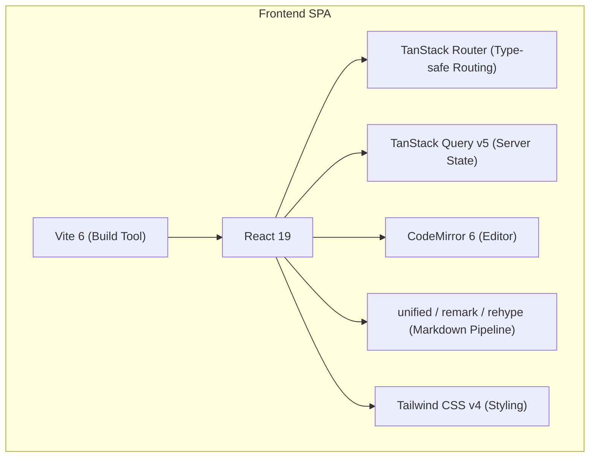
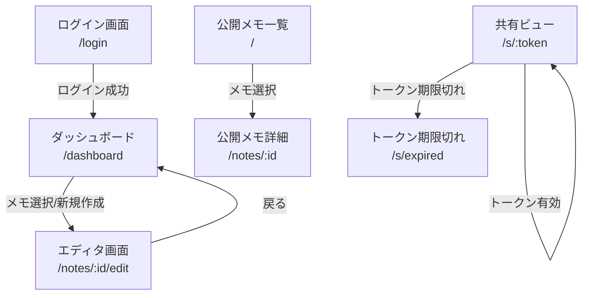
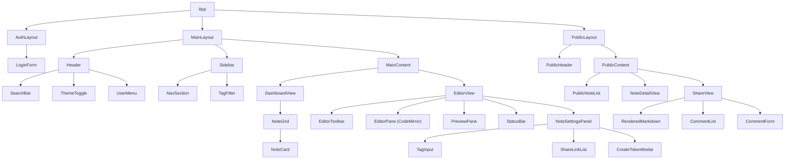

# 04. Frontend Architecture & UI/UX Design System

## 4.1 フロントエンド技術アーキテクチャ

### コア技術構成



| 技術                     | 用途                                                                                             |
| ------------------------ | ------------------------------------------------------------------------------------------------ |
| **react-icons (Lucide)** | 全 UI アイコン。SVG ベースで tree-shakable。統一されたストローク幅で Void Kinetic テーマと調和。 |

### 状態管理戦略

| 状態の種類             | 管理手法                        | 例                                   |
| ---------------------- | ------------------------------- | ------------------------------------ |
| **Server State**       | TanStack Query                  | メモ一覧、タグ、コメント             |
| **UI State**           | React `useState` / `useReducer` | サイドバー開閉、モーダル、テーマ     |
| **Editor State**       | CodeMirror EditorState          | エディタ内容、カーソル位置、選択範囲 |
| **URL State**          | TanStack Router                 | 現在のメモ ID、検索クエリ、フィルタ  |
| **Global Preferences** | `localStorage` + React Context  | テーマ（dark/light）, エディタ設定   |

> [!NOTE]
> **SSOT 原則:** サーバーデータの正規化は TanStack Query のキャッシュに一元化。ローカルに手動で state を同期させる二重管理を避ける。

---

### React 19 活用方針

| 機能               | 活用場面                                 |
| ------------------ | ---------------------------------------- |
| `use()` Hook       | 認証状態の取得、初期データの解決         |
| `useOptimistic()`  | メモ保存時の楽観的 UI 更新               |
| `useActionState()` | ログインフォーム等のフォーム送信状態管理 |
| `<Suspense>`       | ルート遷移時のローディング境界           |

---

## 4.2 デザインシステム — "Void Kinetic Note"

gae-jp.net の "Void Kinetic 2026" コンセプトを継承し、メモアプリケーションに最適化したデザインシステム。

### デザインコンセプト

> **"Void Kinetic Note"** — 漆黒の静寂の中で、思考がライムグリーンの光として具現化する。
> 書くことに没頭できる空間。余計な装飾を排し、コンテンツと操作だけが浮かび上がる。

---

### 4.2.1 カラーシステム

#### ダークモード（プライマリ）

```css
@theme {
    /* ── Void（基盤色） ── */
    --color-void-950: #050505; /* 最深部。エディタ背景 */
    --color-void-900: #0a0a0a; /* gae-jp.net ベース背景 */
    --color-void-800: #111111; /* サイドバー背景 */
    --color-void-700: #1a1a1a; /* カード・パネル背景 */
    --color-void-600: #222222; /* ドロップダウン・ホバー */
    --color-void-500: #2a2a2a; /* ボーダー（微細） */
    --color-void-400: #3a3a3a; /* ボーダー（強調） */
    --color-void-300: #555555; /* ミュートテキスト */
    --color-void-200: #888888; /* セカンダリテキスト */
    --color-void-100: #bbbbbb; /* サブテキスト */
    --color-void-50: #e0e0e0; /* プライマリテキスト */

    /* ── Accent（アクセント） ── */
    --color-accent-500: #c8ff00; /* gae-jp.net アクセント */
    --color-accent-400: #d4ff33; /* ホバー時 */
    --color-accent-300: #e0ff66; /* アクティブ時・選択 */
    --color-accent-600: #a0cc00; /* テキストオンライト */
    --color-accent-glow: rgba(200, 255, 0, 0.15); /* グロー効果 */

    /* ── Semantic（意味色） ── */
    --color-success: #4ade80;
    --color-warning: #fbbf24;
    --color-error: #f87171;
    --color-info: #60a5fa;
}
```

#### ライトモード

```css
@media (prefers-color-scheme: light) {
    :root {
        --color-void-950: #ffffff;
        --color-void-900: #fafafa;
        --color-void-800: #f5f5f5;
        --color-void-700: #eeeeee;
        --color-void-600: #e5e5e5;
        --color-void-500: #d4d4d4;
        --color-void-400: #a3a3a3;
        --color-void-300: #737373;
        --color-void-200: #525252;
        --color-void-100: #404040;
        --color-void-50: #171717;

        --color-accent-500: #84a600;
        --color-accent-400: #6d8a00;
        --color-accent-600: #4a6000;
        --color-accent-glow: rgba(132, 166, 0, 0.1);
    }
}
```

---

### 4.2.2 タイポグラフィ

```css
@theme {
    /* ── Font Families ── */
    --font-heading: 'Outfit', system-ui, sans-serif;
    --font-body: 'Inter', system-ui, sans-serif;
    --font-mono: 'JetBrains Mono', 'Fira Code', monospace;
    --font-jp: 'Zen Kaku Gothic New', 'Hiragino Kaku Gothic ProN', sans-serif;

    /* ── Fluid Type Scale (clamp) ── */
    --text-xs: clamp(0.6875rem, 0.65rem + 0.1vw, 0.75rem); /* 11-12px */
    --text-sm: clamp(0.75rem, 0.7rem + 0.15vw, 0.875rem); /* 12-14px */
    --text-base: clamp(0.875rem, 0.825rem + 0.2vw, 1rem); /* 14-16px */
    --text-lg: clamp(1rem, 0.925rem + 0.3vw, 1.25rem); /* 16-20px */
    --text-xl: clamp(1.25rem, 1.1rem + 0.5vw, 1.75rem); /* 20-28px */
    --text-2xl: clamp(1.5rem, 1.3rem + 0.8vw, 2.25rem); /* 24-36px */
    --text-3xl: clamp(2rem, 1.6rem + 1.2vw, 3rem); /* 32-48px */
}
```

**フォント使用ルール:**

| 用途               | フォント                    | サイズ        | ウェイト |
| ------------------ | --------------------------- | ------------- | -------- |
| ページヘッダー     | Outfit                      | `--text-2xl`  | 700      |
| セクション見出し   | Outfit                      | `--text-xl`   | 600      |
| 本文（日本語含む） | Inter + Zen Kaku Gothic New | `--text-base` | 400      |
| UI ラベル          | Inter                       | `--text-sm`   | 500      |
| コードブロック     | JetBrains Mono              | `--text-sm`   | 400      |
| メタ情報・日付     | Inter                       | `--text-xs`   | 400      |

---

### 4.2.3 スペーシングとレイアウト

```css
@theme {
    /* ── 4px Grid System ── */
    --space-0: 0;
    --space-1: 0.25rem; /* 4px */
    --space-2: 0.5rem; /* 8px */
    --space-3: 0.75rem; /* 12px */
    --space-4: 1rem; /* 16px */
    --space-5: 1.25rem; /* 20px */
    --space-6: 1.5rem; /* 24px */
    --space-8: 2rem; /* 32px */
    --space-10: 2.5rem; /* 40px */
    --space-12: 3rem; /* 48px */
    --space-16: 4rem; /* 64px */

    /* ── Border Radius ── */
    --radius-sm: 0.375rem; /* 6px */
    --radius-md: 0.5rem; /* 8px */
    --radius-lg: 0.75rem; /* 12px */
    --radius-xl: 1rem; /* 16px */
    --radius-full: 9999px;
}
```

---

### 4.2.4 シャドウとエレベーション

```css
@theme {
    /* 深度を意識した微細なシャドウシステム */
    --shadow-xs: 0 1px 2px rgba(0, 0, 0, 0.3);
    --shadow-sm: 0 2px 4px rgba(0, 0, 0, 0.3);
    --shadow-md: 0 4px 8px rgba(0, 0, 0, 0.3), 0 1px 2px rgba(0, 0, 0, 0.2);
    --shadow-lg: 0 8px 16px rgba(0, 0, 0, 0.3), 0 2px 4px rgba(0, 0, 0, 0.2);
    --shadow-xl: 0 16px 32px rgba(0, 0, 0, 0.3), 0 4px 8px rgba(0, 0, 0, 0.2);

    /* グラスモーフィズム（現代的解釈：極薄ボーダー＋微細ブラー） */
    --glass-bg: rgba(17, 17, 17, 0.7);
    --glass-border: rgba(255, 255, 255, 0.06);
    --glass-blur: 12px;
}
```

---

### 4.2.5 アニメーション・マイクロインタラクション

```css
@theme {
    /* ── Easing ── */
    --ease-out: cubic-bezier(0.16, 1, 0.3, 1);
    --ease-in-out: cubic-bezier(0.65, 0, 0.35, 1);
    --ease-spring: cubic-bezier(0.34, 1.56, 0.64, 1);

    /* ── Duration ── */
    --duration-fast: 100ms;
    --duration-normal: 200ms;
    --duration-slow: 400ms;
    --duration-reveal: 600ms;
}
```

**マイクロインタラクション定義:**

| 状態遷移           | アニメーション                                                 | Duration            | Easing          |
| ------------------ | -------------------------------------------------------------- | ------------------- | --------------- |
| ボタンホバー       | `background-color` + `scale(1.02)`                             | `--duration-fast`   | `--ease-out`    |
| サイドバー開閉     | `width` transition + コンテンツ `opacity` fade                 | `--duration-slow`   | `--ease-out`    |
| 保存完了           | チェックマークアイコン `opacity` fade-in + `scale` pop         | `--duration-normal` | `--ease-spring` |
| エラー表示         | `border-color` + `shake` keyframe                              | `--duration-normal` | `--ease-out`    |
| ローディング       | パルスドット + ステータスバーのスプリンガー                    | N/A                 | `linear`        |
| スラッシュコマンド | ドロップダウン `scaleY` + `opacity`                            | `--duration-normal` | `--ease-out`    |
| テーマ切り替え     | 全カラー変数 `transition: color 300ms, background-color 300ms` | 300ms               | `--ease-in-out` |

---

### 4.2.6 アイコンシステム

全 UI アイコンには **[react-icons](https://react-icons.github.io/react-icons/)** の **Lucide** セット (`react-icons/lu`) を使用する。絵文字（Emoji）はプロダクション UI では一切使用しない。

#### ライブラリ選定理由

| 基準             | Lucide (`react-icons/lu`)                                         |
| ---------------- | ----------------------------------------------------------------- |
| **一貫性**       | 均一なストローク幅 (1.5-2px) が Void Kinetic の繊細なラインと調和 |
| **軽量性**       | Tree-shaking 対応。使用アイコンのみバンドルに含まれる             |
| **カスタマイズ** | `size`, `color`, `strokeWidth` を props で制御可能                |
| **カバレッジ**   | 1,400+ アイコン。メモアプリに必要な全アイコンを網羅               |

#### アイコンサイズ規則

```typescript
// icon-sizes.ts
export const ICON_SIZE = {
    xs: 14, // メタ情報、インラインインジケータ
    sm: 16, // ボタンアイコン、サイドバー項目
    md: 20, // ツールバーアイコン、ヘッダーアクション
    lg: 24, // 空状態アイコン、モーダルヘッダー
    xl: 32, // ページ中央の状態表示（期限切れ画面等）
} as const;
```

#### UI アイコンマッピング一覧

| 用途                     | アイコン名                             | import           | サイズ |
| ------------------------ | -------------------------------------- | ---------------- | ------ |
| **ロゴマーク**           | `LuDiamond`                            | `react-icons/lu` | `md`   |
| **検索**                 | `LuSearch`                             | `react-icons/lu` | `md`   |
| **テーマ切替（ダーク）** | `LuMoon`                               | `react-icons/lu` | `sm`   |
| **テーマ切替（ライト）** | `LuSun`                                | `react-icons/lu` | `sm`   |
| **ユーザーメニュー**     | `LuUser`                               | `react-icons/lu` | `sm`   |
| **外部リンク**           | `LuExternalLink`                       | `react-icons/lu` | `sm`   |
| **メモアイコン**         | `LuFileText`                           | `react-icons/lu` | `sm`   |
| **ピン留め**             | `LuPin`                                | `react-icons/lu` | `sm`   |
| **タグ**                 | `LuTag`                                | `react-icons/lu` | `xs`   |
| **新規作成**             | `LuPlus`                               | `react-icons/lu` | `sm`   |
| **エディタモード**       | `LuCode`                               | `react-icons/lu` | `sm`   |
| **プレビューモード**     | `LuEye`                                | `react-icons/lu` | `sm`   |
| **分割モード**           | `LuColumns2`                           | `react-icons/lu` | `sm`   |
| **保存済み**             | `LuCheck`                              | `react-icons/lu` | `sm`   |
| **保存中**               | `LuLoader2` (spin)                     | `react-icons/lu` | `sm`   |
| **未保存**               | `LuCircleDot`                          | `react-icons/lu` | `sm`   |
| **設定**                 | `LuSettings`                           | `react-icons/lu` | `md`   |
| **メニュー（三点）**     | `LuMoreHorizontal`                     | `react-icons/lu` | `md`   |
| **戻る**                 | `LuArrowLeft`                          | `react-icons/lu` | `sm`   |
| **共有リンク**           | `LuLink`                               | `react-icons/lu` | `sm`   |
| **リンクコピー**         | `LuCopy`                               | `react-icons/lu` | `sm`   |
| **トークン無効化**       | `LuShieldOff`                          | `react-icons/lu` | `sm`   |
| **削除**                 | `LuTrash2`                             | `react-icons/lu` | `sm`   |
| **公開設定**             | `LuGlobe`                              | `react-icons/lu` | `sm`   |
| **非公開**               | `LuLock`                               | `react-icons/lu` | `sm`   |
| **パスワード表示**       | `LuEye` / `LuEyeOff`                   | `react-icons/lu` | `sm`   |
| **期限切れ**             | `LuClock`                              | `react-icons/lu` | `xl`   |
| **警告**                 | `LuAlertTriangle`                      | `react-icons/lu` | `sm`   |
| **コメント**             | `LuMessageSquare`                      | `react-icons/lu` | `sm`   |
| **エクスポート**         | `LuDownload`                           | `react-icons/lu` | `sm`   |
| **ページ前後**           | `LuChevronLeft` / `LuChevronRight`     | `react-icons/lu` | `sm`   |
| **サイドバー折りたたみ** | `LuPanelLeftClose` / `LuPanelLeftOpen` | `react-icons/lu` | `sm`   |
| **ハンバーガーメニュー** | `LuMenu`                               | `react-icons/lu` | `md`   |
| **閉じる**               | `LuX`                                  | `react-icons/lu` | `sm`   |
| **チェックリスト**       | `LuListChecks`                         | `react-icons/lu` | `sm`   |

#### 使用ルール

```tsx
// ✅ Good — Lucide SVGアイコンを使用
import { LuFileText, LuSearch } from 'react-icons/lu';

<LuFileText size={16} className="text-void-200" />
<LuSearch size={20} className="text-void-100" />

// ❌ Bad — 絵文字の使用は禁止
<span>📄</span>
<span>🔍</span>
```

---

## 4.3 画面構成 — 全画面仕様

### 4.3.1 画面遷移図



---

### 4.3.2 ログイン画面 (`/login`)

```
┌─────────────────────────────────────────────────────────────────┐
│                                                                 │
│                                                                 │
│                                                                 │
│                      {LuDiamond} note.gae                       │
│                                                                 │
│                  ┌─────────────────────────┐                    │
│                  │  Username               │                    │
│                  └─────────────────────────┘                    │
│                  ┌─────────────────────────┐                    │
│                  │  Password    [LuEyeOff]  │                    │
│                  └─────────────────────────┘                    │
│                                                                 │
│                  ┌─────────────────────────┐                    │
│                  │      Sign In    →       │                    │
│                  └─────────────────────────┘                    │
│                                                                 │
│                                                                 │
│                      © 2026 gae                                 │
│                                                                 │
└─────────────────────────────────────────────────────────────────┘
```

**コンポーネント仕様:**

| 要素           | 仕様                                                                                   |
| -------------- | -------------------------------------------------------------------------------------- |
| ロゴ           | `note.gae` — Outfit フォント, `--text-xl`, アクセントカラー `LuDiamond` アイコン       |
| 背景           | `--color-void-900` + 中央にごく薄いラジアルグラデーション（アクセント色, 5% opacity）  |
| 入力フィールド | `--color-void-700` 背景, `--glass-border` ボーダー, focus 時にアクセントカラーボーダー |
| ボタン         | `--color-accent-500` 背景, `--color-void-900` テキスト, ホバー時 `--color-accent-400`  |
| エラー表示     | フィールド下に `--color-error` テキスト + 入力フィールドが `--color-error` ボーダー    |
| アニメーション | ページ表示時に form 全体が `opacity: 0→1`, `translateY: 8px→0`                         |

---

### 4.3.3 ダッシュボード (`/dashboard`)

```
┌───────────────────────────────────────────────────────────────────────────────────┐
│ {LuDiamond} note.gae    {LuSearch} Search...           [LuMoon] [gae] [LuExternalLink]│
├──────────┬───────────────────────────────────────────────────────────┤
│          │                                                          │
│ NOTES    │   Dashboard                                              │
│          │                                                          │
│ ┌──────┐ │   ┌──────────────────┐ ┌──────────────────┐             │
│ │All 42│ │   │ {LuFileText} API設計メモ │ │ {LuFileText} 日記 2/26  │  │
│ └──────┘ │   │                  │ │                  │             │
│ ┌──────┐ │   │ tech  design    │ │ diary            │             │
│ │{LuPin}Pin│ │  │ Updated 2h ago  │ │ Updated 5h ago   │             │
│ └──────┘ │   └──────────────────┘ └──────────────────┘             │
│          │                                                          │
│ TAGS     │   ┌──────────────────┐ ┌──────────────────┐             │
│          │   │ {LuFileText} React 19 Tips│ │ {LuFileText} 読書ノート │  │
│ ● tech   │   │                  │ │                  │             │
│ ● design │   │ tech  react     │ │ book             │             │
│ ● diary  │   │ Updated 1d ago   │ │ Updated 2d ago   │             │
│ ● book   │   └──────────────────┘ └──────────────────┘             │
│          │                                                          │
│          │   ─ ─ ─ ─ ─ ─ ─ ─ ─ ─ ─ ─ ─ ─ ─ ─ ─ ─ ─              │
│          │                                                          │
│ ──────── │   + New Note                                             │
│ [+ Tag]  │                                                          │
│          │                                                          │
└──────────┴───────────────────────────────────────────────────────────┘
```

**レイアウト構成:**

| エリア               | 幅                       | 背景                                         | 説明                                     |
| -------------------- | ------------------------ | -------------------------------------------- | ---------------------------------------- |
| **ヘッダーバー**     | 100% × 56px              | `--color-void-800` + `--glass-border` bottom | ロゴ、検索、テーマ切替、ユーザーメニュー |
| **サイドバー**       | 240px (折りたたみ: 56px) | `--color-void-800`                           | ナビゲーション、タグフィルタ             |
| **メインコンテンツ** | 残り幅                   | `--color-void-900`                           | メモカードグリッド                       |

**メモカード仕様:**

| 属性       | 値                                                                                      |
| ---------- | --------------------------------------------------------------------------------------- |
| レイアウト | CSS Grid `auto-fill, minmax(280px, 1fr)`                                                |
| 背景       | `--color-void-700`                                                                      |
| ボーダー   | `1px solid --glass-border`                                                              |
| ホバー     | `border-color: --color-accent-500/30`, `--shadow-md`, `translateY(-2px)`                |
| タイトル   | Outfit, `--text-lg`, `--color-void-50` — 最大2行、ellipsis                              |
| タグチップ | `--color-accent-glow` 背景, `--color-accent-500` テキスト, `--radius-full`, `--text-xs` |
| メタ情報   | `--text-xs`, `--color-void-200`                                                         |
| 角丸       | `--radius-lg`                                                                           |

**検索バー仕様:**

| 属性                   | 値                                          |
| ---------------------- | ------------------------------------------- |
| 位置                   | ヘッダー中央                                |
| 幅                     | デスクトップ `400px`, モバイル `100%`       |
| ショートカット         | `⌘ + K` でフォーカス                        |
| 動作                   | デバウンス (300ms) → `GET /api/notes?q=...` |
| インクリメンタルサーチ | 入力中に結果がリアルタイム更新              |

**サイドバー仕様:**

| 属性               | 値                                              |
| ------------------ | ----------------------------------------------- |
| 折りたたみ         | アイコンのみの 56px モードへ toggle             |
| ショートカット     | `⌘ + B` で開閉                                  |
| タグフィルタ       | クリックでトグル選択。複数選択で AND フィルタ。 |
| タグ色インジケータ | タグ名の左に 8px の色付き丸                     |
| `+ Tag` ボタン     | インラインでタグ名入力 → 作成                   |

---

### 4.3.4 エディタ画面 (`/notes/:id/edit`)

````
┌─────────────────────────────────────────────────────────────────────────────────────────────┐
│ {LuDiamond} note.gae  {LuArrowLeft} Dashboard  [{LuCode}][{LuEye}][{LuColumns2}]  {LuCheck} Saved  [{LuSettings}] [{LuMoreHorizontal}]│
├──────────────────────────────┬───────────────────────────────────────┤
│                              │                                      │
│  # Markdown Editor           │  Markdown Editor                    │
│                              │                                      │
│  This is **bold** text and   │  This is bold text and              │
│  `inline code` example.     │  inline code example.               │
│                              │                                      │
│  ## Sub Heading              │  Sub Heading                         │
│                              │                                      │
│  - List item 1              │  • List item 1                       │
│  - List item 2              │  • List item 2                       │
│                              │                                      │
│  ```javascript              │  ┌─────────────────────────────────┐ │
│  const x = 42;              │  │ const x = 42;                  │ │
│  ```                        │  └─────────────────────────────────┘ │
│                              │                                      │
│                              │                                      │
│                              │                                      │
├──────────────────────────────┴───────────────────────────────────────┤
│ Ln 12, Col 34    Words: 156    Markdown    UTF-8                    │
└──────────────────────────────────────────────────────────────────────┘
````

**レイアウトモード:**

| モード         | アイコン     | ショートカット | レイアウト                      |
| -------------- | ------------ | -------------- | ------------------------------- |
| エディタのみ   | `LuCode`     | `⌘ + 1`        | エディタが 100% 幅              |
| プレビューのみ | `LuEye`      | `⌘ + 2`        | プレビューが 100% 幅            |
| 分割表示       | `LuColumns2` | `⌘ + 3`        | 左右 50:50 分割（リサイズ可能） |

**エディタ (左ペイン) 仕様:**

| 属性               | 値                                                                    |
| ------------------ | --------------------------------------------------------------------- |
| エンジン           | CodeMirror 6                                                          |
| テーマ             | カスタム Void Kinetic テーマ（VSCode ライクなシンタックスハイライト） |
| 背景               | `--color-void-950`                                                    |
| フォント           | JetBrains Mono, `--text-sm`, 行高 1.7                                 |
| 行番号             | `--color-void-300`, 右寄せ, 幅 48px                                   |
| アクティブ行       | `--color-void-600/50` 背景ハイライト                                  |
| 選択範囲           | `--color-accent-glow` 背景                                            |
| カーソル           | `--color-accent-500`, 幅 2px, `blink` アニメーション                  |
| 自動保存           | 入力停止 1秒後に自動保存（デバウンス）。`⌘ + S` で即時保存。          |
| スラッシュコマンド | `/` 入力でコマンドパレット表示                                        |

**スラッシュコマンド仕様:**

| コマンド     | 挿入内容             | 説明             |
| ------------ | -------------------- | ---------------- |
| `/h1`        | `# `                 | 見出し 1         |
| `/h2`        | `## `                | 見出し 2         |
| `/h3`        | `### `               | 見出し 3         |
| `/bold`      | `**text**`           | 太字             |
| `/italic`    | `*text*`             | 斜体             |
| `/code`      | `` `code` ``         | インラインコード |
| `/codeblock` | ` ```\n\n``` `       | コードブロック   |
| `/list`      | `- `                 | 箇条書き         |
| `/checklist` | `- [ ] `             | チェックリスト   |
| `/quote`     | `> `                 | 引用             |
| `/table`     | テーブルテンプレート | テーブル         |
| `/divider`   | `---`                | 水平線           |
| `/link`      | `[text](url)`        | リンク           |
| `/image`     | ``        | 画像             |

**プレビュー (右ペイン) 仕様:**

| 属性           | 値                                                                                        |
| -------------- | ----------------------------------------------------------------------------------------- |
| レンダリング   | unified → remark-parse → remark-gfm → rehype → rehype-sanitize → rehype-highlight → React |
| 背景           | `--color-void-900`                                                                        |
| タイポグラフィ | 本文 Inter + Zen Kaku Gothic New, 見出し Outfit                                           |
| コードブロック | `--color-void-700` 背景, `--radius-md`, syntax highlight (One Dark ベース)                |
| スクロール同期 | エディタのスクロール位置とプレビューを同期（割合ベース）                                  |
| リンク         | `--color-accent-500`, ホバーで underline                                                  |
| 画像           | `max-width: 100%`, `--radius-md`, ローディング中 skeleton                                 |

**ツールバー仕様:**

| 属性                          | 値                                                                                                                |
| ----------------------------- | ----------------------------------------------------------------------------------------------------------------- |
| 保存ステータス                | `{LuCheck} Saved` (グリーン) / `{LuLoader2} Saving...` (spin アニメーション) / `{LuCircleDot} Unsaved` (イエロー) |
| 設定 `{LuSettings}`           | エディタ設定モーダル: フォントサイズ、行の折り返し、行番号表示                                                    |
| メニュー `{LuMoreHorizontal}` | 共有リンク発行、公開設定、エクスポート(.md)、削除                                                                 |

**ステータスバー (下部) 仕様:**

| 表示            | 説明             |
| --------------- | ---------------- |
| `Ln 12, Col 34` | カーソル位置     |
| `Words: 156`    | 単語数           |
| `Markdown`      | ファイルタイプ   |
| `UTF-8`         | エンコーディング |

---

### 4.3.5 メモ詳細の管理パネル

エディタ画面の `⋯` メニューまたはサイドパネルで表示。

```
┌────────────────────────────────────┐
│ Note Settings                      │
├────────────────────────────────────┤
│                                    │
│ Title                              │
│ ┌────────────────────────────────┐ │
│ │ API設計メモ                    │ │
│ └────────────────────────────────┘ │
│                                    │
│ Tags                               │
│ [tech ×] [design ×] [+ Add Tag]   │
│                                    │
│ Visibility                         │
│ ○ Private    ● Public              │
│                                    │
│ ─────────────────────────────────  │
│                                    │
│ Share Links                    [+] │
│ ┌────────────────────────────────┐ │
│ │ {LuLink} 田中さん用            │ │
│ │ Expires: 2026-03-06           │ │
│ │ [Copy URL] [Revoke]           │ │
│ └────────────────────────────────┘ │
│ ┌────────────────────────────────┐ │
│ │ {LuLink} チームA               │ │
│ │ {LuAlertTriangle} Expired: 2026-02-20 │ │
│ │ [Expired]                     │ │
│ └────────────────────────────────┘ │
│                                    │
│ ─────────────────────────────────  │
│                                    │
│ {LuTrash2} Delete Note              │
│                                    │
└────────────────────────────────────┘
```

**共有リンク発行モーダル:**

```
┌──────────────────────────────┐
│ Create Share Link            │
├──────────────────────────────┤
│                              │
│ Label (optional)             │
│ ┌──────────────────────────┐ │
│ │ e.g. 田中さん用          │ │
│ └──────────────────────────┘ │
│                              │
│ Expires in                   │
│ [▿ 7 days                 ]  │
│ ┌──────────────────────────┐ │
│ │ 1 hour                  │ │
│ │ 1 day                   │ │
│ │ 7 days          ◄       │ │
│ │ 30 days                 │ │
│ └──────────────────────────┘ │
│                              │
│ [Cancel]   [Create Link]     │
│                              │
└──────────────────────────────┘
```

---

### 4.3.6 共有ビュー (`/s/:token`)

```
┌──────────────────────────────────────────────────────────────────────┐
│ {LuDiamond} note.gae                                  Shared with you  │
├──────────────────────────────────────────────────────────────────────┤
│                                                                      │
│                    API設計メモ                                        │
│                    tech  design                                      │
│                    Shared by gae · Expires Mar 6, 2026               │
│                                                                      │
│  ┌─────────────────────────────────────────────────────────────────┐ │
│  │                                                                 │ │
│  │  [Rendered Markdown Content]                                    │ │
│  │                                                                 │ │
│  │  # API設計メモ                                                   │ │
│  │                                                                 │ │
│  │  This is the content of the note...                             │ │
│  │                                                                 │ │
│  └─────────────────────────────────────────────────────────────────┘ │
│                                                                      │
│  ─────────────────────────────────────────────────────────────────   │
│                                                                      │
│  Comments (3)                                                        │
│                                                                      │
│  ┌─────────────────────────────────────────────────────────────────┐ │
│  │ gae · 2h ago                                                    │ │
│  │ ここの設計は要検討。                                               │ │
│  └─────────────────────────────────────────────────────────────────┘ │
│  ┌─────────────────────────────────────────────────────────────────┐ │
│  │ 田中太郎 · 1h ago                                               │ │
│  │ 了解しました。修正案を別途送ります。                                  │ │
│  └─────────────────────────────────────────────────────────────────┘ │
│                                                                      │
│  ┌─────────────────────────────────────────────────────────────────┐ │
│  │ Your Name                                                       │ │
│  │ ┌───────────────────────────────────────────────────┐           │ │
│  │ │ Write a comment...                               │           │ │
│  │ └───────────────────────────────────────────────────┘           │ │
│  │                                     [Add Comment]               │ │
│  └─────────────────────────────────────────────────────────────────┘ │
│                                                                      │
│  © 2026 gae                                                          │
└──────────────────────────────────────────────────────────────────────┘
```

**共有ビュー仕様:**

| 要素           | 仕様                                                              |
| -------------- | ----------------------------------------------------------------- |
| レイアウト     | 単一カラム、`max-width: 768px`, 中央寄せ                          |
| 本文表示       | プレビューペインと同一のレンダリングパイプライン                  |
| コメントカード | `--color-void-700` 背景, `--radius-md`                            |
| コメント入力   | `authorName` フィールド + `body` テキストエリア                   |
| 有効期限表示   | ヘッダーに `Expires: ...` を表示。残り24h以下で `--color-warning` |
| 編集不可       | エディタは非表示。Markdown 本文のみレンダリング                   |

---

### 4.3.7 トークン期限切れ画面 (`/s/expired`)

```
┌──────────────────────────────────────────────────────────────────────┐
│                                                                      │
│                                                                      │
│                     {LuDiamond} note.gae                             │
│                                                                      │
│                    {LuClock} Link Expired                             │
│                                                                      │
│           This share link has expired or been revoked.               │
│           Please contact the note owner for a new link.              │
│                                                                      │
│                      [Go to Home →]                                  │
│                                                                      │
│                                                                      │
└──────────────────────────────────────────────────────────────────────┘
```

---

### 4.3.8 公開メモ一覧 (`/`)

```
┌──────────────────────────────────────────────────────────────────────┐
│ {LuDiamond} note.gae                                    [Login →]  │
├──────────────────────────────────────────────────────────────────────┤
│                                                                      │
│   Public Notes by gae                                                │
│                                                                      │
│   ┌─────────────────────────────────────────────────────────────┐    │
│   │ {LuFileText} React 19のuse()フックについて                     │    │
│   │ tech  react                                                 │    │
│   │ Feb 25, 2026                                                │    │
│   └─────────────────────────────────────────────────────────────┘    │
│   ┌─────────────────────────────────────────────────────────────┐    │
│   │ {LuFileText} Tailwind CSS v4移行ガイド                        │    │
│   │ tech  css                                                   │    │
│   │ Feb 20, 2026                                                │    │
│   └─────────────────────────────────────────────────────────────┘    │
│                                                                      │
│   [← Previous]  Page 1 of 3  [Next →]                               │
│                                                                      │
│   © 2026 gae                                                         │
└──────────────────────────────────────────────────────────────────────┘
```

**公開ビュー仕様:**

| 要素             | 仕様                                                    |
| ---------------- | ------------------------------------------------------- |
| レイアウト       | 単一カラム、`max-width: 768px`, 中央寄せ                |
| メモカード       | `--color-void-700` 背景, リスト形式（グリッドではない） |
| Login リンク     | ヘッダー右上に控えめに配置。`--color-void-200` テキスト |
| ページネーション | `Previous / Next` ボタン。現在ページ番号表示。          |
| コメント         | 非表示（Public はコメント閲覧不可）                     |

---

### 4.3.9 公開メモ詳細 (`/notes/:id`)

共有ビュー (`/s/:token`) と同一レイアウトだが以下が異なる:

| 差分           | 共有ビュー        | 公開ビュー    |
| -------------- | ----------------- | ------------- |
| ヘッダーバッジ | `Shared with you` | `Public Note` |
| 有効期限       | 表示あり          | 非表示        |
| コメント       | 閲覧 + 投稿可能   | 非表示        |

---

## 4.4 UI コンポーネント設計

### コンポーネント階層図



### 共通コンポーネント

| コンポーネント | Props                                | 説明                                       |
| -------------- | ------------------------------------ | ------------------------------------------ |
| `Button`       | `variant`, `size`, `loading`, `icon` | Primary / Ghost / Danger バリアント        |
| `Input`        | `label`, `error`, `icon`             | テキスト入力。バリデーションエラー表示対応 |
| `Badge`        | `color`, `size`, `removable`         | タグチップ表示                             |
| `Modal`        | `title`, `open`, `onClose`           | モーダルダイアログ。`Escape` キーで閉じる  |
| `Dropdown`     | `items`, `trigger`                   | ドロップダウンメニュー                     |
| `Skeleton`     | `width`, `height`, `count`           | ローディングプレースホルダー               |
| `Toast`        | `type`, `message`, `duration`        | 通知トースト。右下に表示。自動消去。       |
| `Tooltip`      | `content`, `position`                | ホバーツールチップ                         |
| `Kbd`          | `keys`                               | キーボードショートカット表示 (`⌘`, `K` 等) |

---

## 4.5 キーボードショートカット

| ショートカット  | 動作                  | コンテキスト            |
| --------------- | --------------------- | ----------------------- |
| `⌘ + K`         | 検索バーにフォーカス  | 全画面                  |
| `⌘ + B`         | サイドバー開閉        | ダッシュボード/エディタ |
| `⌘ + N`         | 新規メモ作成          | ダッシュボード          |
| `⌘ + S`         | メモ保存              | エディタ                |
| `⌘ + 1`         | エディタモード        | エディタ                |
| `⌘ + 2`         | プレビューモード      | エディタ                |
| `⌘ + 3`         | 分割モード            | エディタ                |
| `⌘ + Shift + D` | テーマ切替            | 全画面                  |
| `Escape`        | モーダル/パネル閉じる | モーダル展開時          |

---

## 4.6 レスポンシブデザイン

| ブレークポイント | 幅           | レイアウト変更                                                            |
| ---------------- | ------------ | ------------------------------------------------------------------------- |
| `sm`             | `< 640px`    | サイドバー非表示（ハンバーガーメニュー化）、エディタのみモード、カード1列 |
| `md`             | `640-1024px` | サイドバー折りたたみデフォルト、エディタ/プレビュー切替タブ、カード2列    |
| `lg`             | `> 1024px`   | サイドバー展開、分割ビュー、カード3-4列                                   |

---

## 4.7 アクセシビリティ

| 項目                   | 対応                                                |
| ---------------------- | --------------------------------------------------- |
| WAI-ARIA               | 全インタラクティブ要素に適切な `role`, `aria-label` |
| キーボードナビ         | Tab 順序の論理的構成、`focus-visible` リング        |
| カラーコントラスト     | WCAG 2.2 AA 準拠（テキスト 4.5:1 以上）             |
| スクリーンリーダー     | メモリスト・コメントリストの `aria-live` リージョン |
| リデュースドモーション | `prefers-reduced-motion` 対応でアニメーション無効化 |
