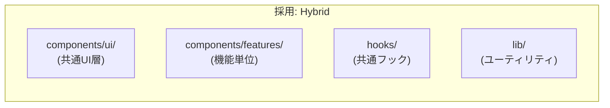

# 05. Directory Structure

## 5.1 プロジェクト概要

bun workspaces によるモノレポ構成。Frontend（React SPA）と Backend（Hono API）を明確に分離し、共通の型定義パッケージで接続する。

---

## 5.2 ディレクトリツリー全体像

```
note-gae-jp/
├── .env                          # 環境変数（ルート共有）
├── .env.example                  # 環境変数テンプレート
├── .gitignore
├── package.json                  # ワークスペースルート
├── bun.lock                      # bun ロックファイル
├── tsconfig.base.json            # 共通 TypeScript 設定
├── README.md
│
├── docs/                         # 設計ドキュメント（本ファイル群）
│   ├── 01_system_architecture.md
│   ├── 02_database_schema.md
│   ├── 03_api_specification.md
│   ├── 04_frontend_architecture_and_uiux.md
│   └── 05_directory_structure.md
│
├── packages/
│   │
│   ├── shared/                   # 共有パッケージ（型定義・バリデーション）
│   │   ├── package.json
│   │   ├── tsconfig.json
│   │   └── src/
│   │       ├── index.ts          # バレルエクスポート
│   │       ├── types/
│   │       │   ├── note.ts       # Note 型定義
│   │       │   ├── tag.ts        # Tag 型定義
│   │       │   ├── comment.ts    # Comment 型定義
│   │       │   ├── auth.ts       # Auth 関連型
│   │       │   └── api.ts        # API レスポンスエンベロープ型
│   │       └── schemas/
│   │           ├── note.ts       # Zod スキーマ（createNote, updateNote）
│   │           ├── tag.ts        # Zod スキーマ（createTag, updateTag）
│   │           ├── comment.ts    # Zod スキーマ（createComment）
│   │           ├── auth.ts       # Zod スキーマ（login）
│   │           └── token.ts      # Zod スキーマ（createToken）
│   │
│   ├── backend/                  # バックエンド（Hono API Server）
│   │   ├── package.json
│   │   ├── tsconfig.json
│   │   ├── drizzle.config.ts     # Drizzle マイグレーション設定
│   │   └── src/
│   │       ├── index.ts          # エントリーポイント（Hono app 初期化）
│   │       ├── env.ts            # 環境変数バリデーション
│   │       │
│   │       ├── db/
│   │       │   ├── schema.ts     # Drizzle テーブル定義（SSOT）
│   │       │   ├── client.ts     # DB 接続初期化
│   │       │   ├── seed.ts       # 初期データ投入（Admin ユーザー等）
│   │       │   └── migrations/   # Drizzle 自動生成マイグレーション
│   │       │
│   │       ├── middleware/
│   │       │   ├── auth.ts       # 認証・認可ミドルウェア
│   │       │   ├── cors.ts       # CORS 設定
│   │       │   └── rate-limit.ts # レート制限
│   │       │
│   │       ├── routes/
│   │       │   ├── auth.ts       # /api/auth/* ルート
│   │       │   ├── notes.ts      # /api/notes/* ルート
│   │       │   ├── tags.ts       # /api/tags/* ルート
│   │       │   ├── tokens.ts     # /api/notes/:noteId/tokens/*, /api/tokens/* ルート
│   │       │   ├── comments.ts   # /api/notes/:noteId/comments/*, /api/comments/* ルート
│   │       │   └── public.ts     # /api/public/* ルート
│   │       │
│   │       └── services/
│   │           ├── auth.ts       # 認証ロジック（ハッシュ検証、セッション管理）
│   │           ├── notes.ts      # メモ CRUD ロジック
│   │           ├── tags.ts       # タグ CRUD ロジック
│   │           ├── tokens.ts     # 共有トークン発行・検証ロジック
│   │           ├── comments.ts   # コメント CRUD ロジック
│   │           └── search.ts     # 全文検索ロジック
│   │
│   └── frontend/                 # フロントエンド（React SPA）
│       ├── package.json
│       ├── tsconfig.json
│       ├── vite.config.ts        # Vite 設定（プロキシ、エイリアス）
│       ├── index.html            # SPA エントリー HTML
│       │
│       └── src/
│           ├── main.tsx          # React エントリーポイント
│           ├── app.tsx           # ルーター・プロバイダー設定
│           │
│           ├── styles/
│           │   └── global.css    # Tailwind v4 @theme 定義 + グローバルスタイル
│           │
│           ├── lib/
│           │   ├── api-client.ts # fetch ラッパー（認証 Cookie 自動付与）
│           │   ├── markdown.ts   # unified パイプライン設定
│           │   └── utils.ts      # ユーティリティ関数
│           │
│           ├── hooks/
│           │   ├── use-auth.ts         # 認証状態管理フック
│           │   ├── use-notes.ts        # メモ CRUD フック（TanStack Query）
│           │   ├── use-tags.ts         # タグ CRUD フック
│           │   ├── use-comments.ts     # コメントフック
│           │   ├── use-search.ts       # 検索フック（デバウンス付き）
│           │   ├── use-theme.ts        # テーマ切替フック
│           │   ├── use-autosave.ts     # 自動保存フック
│           │   └── use-shortcuts.ts    # キーボードショートカットフック
│           │
│           ├── components/
│           │   ├── ui/                 # 汎用UIコンポーネント
│           │   │   ├── button.tsx
│           │   │   ├── input.tsx
│           │   │   ├── badge.tsx
│           │   │   ├── modal.tsx
│           │   │   ├── dropdown.tsx
│           │   │   ├── skeleton.tsx
│           │   │   ├── toast.tsx
│           │   │   ├── tooltip.tsx
│           │   │   └── kbd.tsx
│           │   │
│           │   ├── layout/             # レイアウトコンポーネント
│           │   │   ├── header.tsx
│           │   │   ├── sidebar.tsx
│           │   │   ├── main-layout.tsx
│           │   │   ├── auth-layout.tsx
│           │   │   └── public-layout.tsx
│           │   │
│           │   └── features/           # 機能別コンポーネント
│           │       ├── auth/
│           │       │   └── login-form.tsx
│           │       │
│           │       ├── dashboard/
│           │       │   ├── note-grid.tsx
│           │       │   ├── note-card.tsx
│           │       │   ├── search-bar.tsx
│           │       │   └── tag-filter.tsx
│           │       │
│           │       ├── editor/
│           │       │   ├── editor-view.tsx        # エディタ画面コンテナ
│           │       │   ├── editor-pane.tsx         # CodeMirror エディタ
│           │       │   ├── preview-pane.tsx        # Markdown プレビュー
│           │       │   ├── editor-toolbar.tsx      # ツールバー
│           │       │   ├── status-bar.tsx          # ステータスバー
│           │       │   ├── slash-command.tsx        # スラッシュコマンドUI
│           │       │   └── codemirror-theme.ts     # Void Kinetic CM テーマ
│           │       │
│           │       ├── settings/
│           │       │   ├── note-settings-panel.tsx # メモ設定パネル
│           │       │   ├── tag-input.tsx           # タグ入力・管理
│           │       │   ├── share-link-list.tsx     # 共有リンク一覧
│           │       │   └── create-token-modal.tsx  # トークン発行モーダル
│           │       │
│           │       ├── share/
│           │       │   ├── share-view.tsx          # 共有ビューページ
│           │       │   ├── comment-list.tsx        # コメント一覧
│           │       │   ├── comment-form.tsx        # コメント投稿フォーム
│           │       │   └── token-expired.tsx       # 期限切れ表示
│           │       │
│           │       └── public/
│           │           ├── public-note-list.tsx    # 公開メモ一覧
│           │           └── note-detail-view.tsx    # 公開メモ詳細
│           │
│           └── routes/                 # TanStack Router ルート定義
│               ├── __root.tsx          # ルートレイアウト
│               ├── login.tsx           # /login
│               ├── _auth.tsx           # 認証必須レイアウト
│               ├── _auth/
│               │   ├── dashboard.tsx   # /dashboard
│               │   └── notes/
│               │       └── $noteId/
│               │           └── edit.tsx # /notes/:noteId/edit
│               ├── s/
│               │   ├── $token.tsx      # /s/:token（共有ビュー）
│               │   └── expired.tsx     # /s/expired
│               ├── index.tsx           # /（公開メモ一覧）
│               └── notes/
│                   └── $noteId.tsx     # /notes/:noteId（公開メモ詳細）
```

---

## 5.3 設計判断の根拠

### Feature-first vs. Layer-first



| 決定                              | 理由                                                                       |
| --------------------------------- | -------------------------------------------------------------------------- |
| `components/ui/` を独立           | 複数機能で再利用される Button, Modal 等は共通レイヤーに配置（DRY）         |
| `components/features/` で機能分割 | 関連コンポーネントの局所性を高め、変更影響範囲を限定（Clean Architecture） |
| `hooks/` はフラット               | フックの数が限定的なため、ネストは不要（KISS）。増加時に機能別に分割可能。 |
| `routes/` は TanStack Router 規約 | ファイルベースルーティングの恩恵を受ける。ルートとコンポーネントの分離。   |

### Backend の `routes/` vs. `services/`

| レイヤー    | 責務                                                                           |
| ----------- | ------------------------------------------------------------------------------ |
| `routes/`   | HTTP リクエスト/レスポンスの処理。バリデーション呼び出し。サービス層への委譲。 |
| `services/` | ビジネスロジック。DB 操作。テスタビリティの確保（HTTP 層から独立）。           |

### `packages/shared/` の役割

| 用途             | 利点                                                                         |
| ---------------- | ---------------------------------------------------------------------------- |
| 型定義の SSOT    | Frontend と Backend で同じ `Note`, `Tag`, `Comment` 型を参照                 |
| Zod スキーマ共有 | サーバー側バリデーションとクライアント側フォームバリデーションで同一スキーマ |
| API 型安全性     | レスポンス型を共有し、フロントの型キャストを排除                             |
