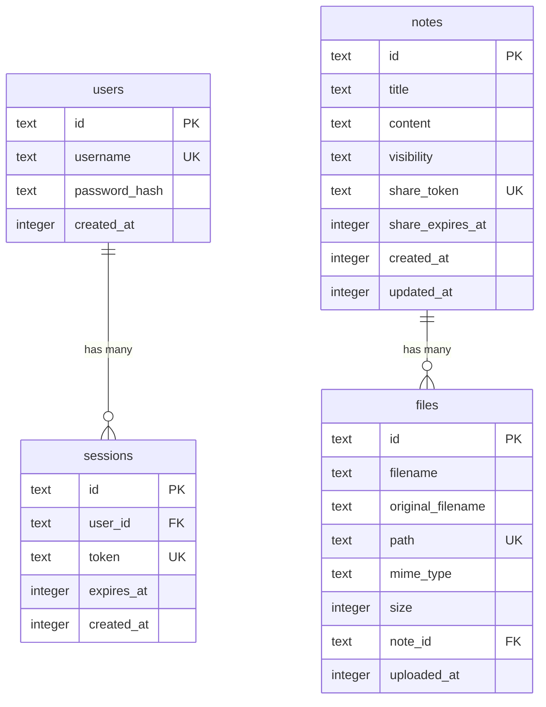

# データベース設計書

## 1. データベース概要

### 1.1 基本情報

| 項目                 | 値                        |
| -------------------- | ------------------------- |
| DBMS                 | SQLite 3.x                |
| ORM                  | Drizzle ORM               |
| ファイル名           | `data.db`                 |
| 配置場所             | `data/data.db`            |
| 文字エンコーディング | UTF-8                     |
| Journal Mode         | WAL (Write-Ahead Logging) |
| Foreign Keys         | PRAGMA foreign_keys = ON  |

### 1.2 設計方針

- **正規化:** 第3正規形を基本とする
- **命名規則:** スネークケース（`user_id`, `created_at`）
- **主キー:** ULID または UUID を使用（自動採番は使用しない）
- **タイムスタンプ:** Unix Timestamp (秒) で保存、UTCベース
- **NULL許容:** 明示的な必要性がない限りNOT NULLとする
- **インデックス:** 検索・JOIN対象カラムには適切にインデックスを設定

---

## 2. テーブル定義

### 2.1 users テーブル

管理者アカウント情報を格納する。本システムは単一ユーザー前提のため、通常1レコードのみ存在する。

#### スキーマ定義

```typescript
import { sqliteTable, text, integer } from 'drizzle-orm/sqlite-core';
import { sql } from 'drizzle-orm';

export const users = sqliteTable('users', {
    id: text('id').primaryKey(),
    username: text('username').notNull().unique(),
    passwordHash: text('password_hash').notNull(),
    createdAt: integer('created_at', { mode: 'timestamp' })
        .notNull()
        .default(sql`(unixepoch())`),
});
```

#### カラム詳細

| カラム名      | 型      | NULL | デフォルト値 | 説明                                 |
| ------------- | ------- | ---- | ------------ | ------------------------------------ |
| id            | TEXT    | ×    | -            | ユーザーID（ULID）                   |
| username      | TEXT    | ×    | -            | ログインID（ユニーク）               |
| password_hash | TEXT    | ×    | -            | bcrypt ハッシュ化されたパスワード    |
| created_at    | INTEGER | ×    | unixepoch()  | アカウント作成日時（Unix Timestamp） |

#### インデックス

```sql
CREATE UNIQUE INDEX idx_users_username ON users(username);
```

#### 制約

- `username` は UNIQUE
- `password_hash` は bcrypt または argon2 でハッシュ化されたもの（60文字以上推奨）

#### サンプルデータ

```typescript
// Seed script example
import { ulid } from 'ulid';
import bcrypt from 'bcryptjs';

const adminUser = {
    id: ulid(),
    username: 'admin',
    passwordHash: await bcrypt.hash('SecurePassword123!', 10),
    createdAt: new Date(),
};
```

---

### 2.2 notes テーブル

メモ本体および公開設定を管理する。

#### スキーマ定義

```typescript
export const notes = sqliteTable('notes', {
    id: text('id').primaryKey(),

    title: text('title').notNull(),
    content: text('content').notNull(),

    // Visibility settings
    visibility: text('visibility', {
        enum: ['private', 'public', 'shared'],
    })
        .notNull()
        .default('private'),

    // Link sharing
    shareToken: text('share_token').unique(),
    shareExpiresAt: integer('share_expires_at', { mode: 'timestamp' }),

    // Metadata
    createdAt: integer('created_at', { mode: 'timestamp' })
        .notNull()
        .default(sql`(unixepoch())`),
    updatedAt: integer('updated_at', { mode: 'timestamp' })
        .notNull()
        .default(sql`(unixepoch())`),
});
```

#### カラム詳細

| カラム名         | 型      | NULL | デフォルト値 | 説明                                                    |
| ---------------- | ------- | ---- | ------------ | ------------------------------------------------------- |
| id               | TEXT    | ×    | -            | メモID（ULID）                                          |
| title            | TEXT    | ×    | -            | メモのタイトル                                          |
| content          | TEXT    | ×    | -            | Markdown形式の本文                                      |
| visibility       | TEXT    | ×    | 'private'    | 公開範囲（'private', 'public', 'shared'）               |
| share_token      | TEXT    | ○    | NULL         | 共有用トークン（UUIDv4、visibility='shared'時のみ設定） |
| share_expires_at | INTEGER | ○    | NULL         | 共有リンク有効期限（Unix Timestamp、NULL=無期限）       |
| created_at       | INTEGER | ×    | unixepoch()  | 作成日時                                                |
| updated_at       | INTEGER | ×    | unixepoch()  | 最終更新日時                                            |

#### インデックス

```sql
-- 公開メモの高速取得
CREATE INDEX idx_notes_visibility ON notes(visibility);

-- 更新日時でのソート用
CREATE INDEX idx_notes_updated_at ON notes(updated_at DESC);

-- 共有トークン検索用（UNIQUE）
CREATE UNIQUE INDEX idx_notes_share_token ON notes(share_token) WHERE share_token IS NOT NULL;

-- 期限切れ共有リンクのクリーンアップ用
CREATE INDEX idx_notes_share_expires_at ON notes(share_expires_at) WHERE share_expires_at IS NOT NULL;
```

#### 制約

- `visibility` は `'private'`, `'public'`, `'shared'` のいずれか
- `share_token` は `visibility = 'shared'` の場合のみ設定
- `share_token` は UUID v4 形式（36文字）
- `share_expires_at` は未来の日時、または NULL（無期限）

#### ビジネスロジック制約

```typescript
// Service Layer で実装すべきルール
const validateNoteVisibility = (note: Note) => {
    if (note.visibility === 'shared') {
        // sharedの場合、share_tokenは必須
        if (!note.shareToken) {
            throw new Error('share_token is required for shared notes');
        }
    } else {
        // private/publicの場合、share_tokenは不要
        if (note.shareToken) {
            throw new Error(
                'share_token should not be set for non-shared notes',
            );
        }
    }

    // 期限切れチェック
    if (note.shareExpiresAt && note.shareExpiresAt < new Date()) {
        throw new Error('Share link has expired');
    }
};
```

---

### 2.3 files テーブル

アップロードされたファイルのメタデータを管理する。物理ファイルは `uploads/` ディレクトリに保存。

#### スキーマ定義

```typescript
export const files = sqliteTable('files', {
    id: text('id').primaryKey(),

    filename: text('filename').notNull(),
    originalFilename: text('original_filename').notNull(),
    path: text('path').notNull().unique(),

    mimeType: text('mime_type').notNull(),
    size: integer('size').notNull(),

    // Optional: Note association
    noteId: text('note_id').references(() => notes.id, {
        onDelete: 'set null',
    }),

    uploadedAt: integer('uploaded_at', { mode: 'timestamp' })
        .notNull()
        .default(sql`(unixepoch())`),
});
```

#### カラム詳細

| カラム名          | 型      | NULL | デフォルト値 | 説明                                                   |
| ----------------- | ------- | ---- | ------------ | ------------------------------------------------------ |
| id                | TEXT    | ×    | -            | ファイルID（ULID）                                     |
| filename          | TEXT    | ×    | -            | サーバー保存時のファイル名（一意、安全な名前）         |
| original_filename | TEXT    | ×    | -            | ユーザーがアップロードした元のファイル名               |
| path              | TEXT    | ×    | -            | サーバー上の相対パス（例: `uploads/2026/02/ulid.png`） |
| mime_type         | TEXT    | ×    | -            | MIMEタイプ（例: `image/png`, `application/pdf`）       |
| size              | INTEGER | ×    | -            | ファイルサイズ（バイト）                               |
| note_id           | TEXT    | ○    | NULL         | 関連するメモID（外部キー、削除時はNULL）               |
| uploaded_at       | INTEGER | ×    | unixepoch()  | アップロード日時                                       |

#### インデックス

```sql
-- パスでの一意性保証
CREATE UNIQUE INDEX idx_files_path ON files(path);

-- メモに紐づくファイル検索用
CREATE INDEX idx_files_note_id ON files(note_id) WHERE note_id IS NOT NULL;

-- アップロード日時でのソート用
CREATE INDEX idx_files_uploaded_at ON files(uploaded_at DESC);
```

#### 制約

- `path` は UNIQUE（物理ファイルとの1対1対応）
- `size` は正の整数（0バイトファイルは拒否）
- `mime_type` は許可されたMIMEタイプのみ（バリデーションはアプリケーション層）

#### ファイル命名規則

```typescript
// Service Layer での実装例
import { ulid } from 'ulid';
import path from 'path';

const generateFilePath = (originalFilename: string): string => {
    const ext = path.extname(originalFilename);
    const id = ulid();
    const year = new Date().getFullYear();
    const month = String(new Date().getMonth() + 1).padStart(2, '0');

    return `uploads/${year}/${month}/${id}${ext}`;
};

// Example: uploads/2026/02/01HQXZ9Y8K7J6M5N4P3Q2R1S0T.png
```

---

### 2.4 sessions テーブル（オプション）

セッション情報を管理する。Hono Session Middleware が自動生成する可能性があるが、明示的に定義する場合。

#### スキーマ定義

```typescript
export const sessions = sqliteTable('sessions', {
    id: text('id').primaryKey(),

    userId: text('user_id')
        .notNull()
        .references(() => users.id, { onDelete: 'cascade' }),

    token: text('token').notNull().unique(),

    expiresAt: integer('expires_at', { mode: 'timestamp' }).notNull(),

    createdAt: integer('created_at', { mode: 'timestamp' })
        .notNull()
        .default(sql`(unixepoch())`),
});
```

#### カラム詳細

| カラム名   | 型      | NULL | デフォルト値 | 説明                               |
| ---------- | ------- | ---- | ------------ | ---------------------------------- |
| id         | TEXT    | ×    | -            | セッションID（ULID）               |
| user_id    | TEXT    | ×    | -            | ユーザーID（外部キー）             |
| token      | TEXT    | ×    | -            | セッショントークン（ランダム生成） |
| expires_at | INTEGER | ×    | -            | 有効期限（Unix Timestamp）         |
| created_at | INTEGER | ×    | unixepoch()  | 作成日時                           |

#### インデックス

```sql
CREATE UNIQUE INDEX idx_sessions_token ON sessions(token);
CREATE INDEX idx_sessions_user_id ON sessions(user_id);
CREATE INDEX idx_sessions_expires_at ON sessions(expires_at);
```

---

## 3. リレーションシップ



---

## 4. 全文検索 (FTS5)

SQLite の FTS5 (Full-Text Search 5) を使用し、メモのタイトルと本文を高速検索する。

### 4.1 FTS5 仮想テーブル定義

```sql
CREATE VIRTUAL TABLE notes_fts USING fts5(
  id UNINDEXED,
  title,
  content,
  content=notes,
  content_rowid=id
);
```

**説明:**

- `id UNINDEXED`: 検索対象外（JOIN用）
- `title`, `content`: 検索対象カラム
- `content=notes`: ベーステーブルは `notes`
- `content_rowid=id`: 主キーは `id`（TEXTだがFTS5は対応）

### 4.2 FTS5 トリガー設定

```sql
-- INSERT時: FTS5にデータを追加
CREATE TRIGGER notes_fts_insert AFTER INSERT ON notes
BEGIN
  INSERT INTO notes_fts(id, title, content)
  VALUES (new.id, new.title, new.content);
END;

-- UPDATE時: FTS5のデータを更新
CREATE TRIGGER notes_fts_update AFTER UPDATE ON notes
BEGIN
  UPDATE notes_fts
  SET title = new.title, content = new.content
  WHERE id = old.id;
END;

-- DELETE時: FTS5からデータを削除
CREATE TRIGGER notes_fts_delete AFTER DELETE ON notes
BEGIN
  DELETE FROM notes_fts WHERE id = old.id;
END;
```

### 4.3 検索クエリ例

```typescript
// Drizzle ORM での FTS5 検索（生SQL使用）
import { db } from './client';

const searchNotes = async (query: string, visibility?: string) => {
    const visibilityFilter = visibility
        ? `AND n.visibility = '${visibility}'`
        : '';

    const results = await db.all(
        sql`
    SELECT
      n.id,
      n.title,
      n.content,
      n.visibility,
      n.created_at,
      n.updated_at,
      snippet(notes_fts, 1, '<mark>', '</mark>', '...', 32) as title_snippet,
      snippet(notes_fts, 2, '<mark>', '</mark>', '...', 64) as content_snippet,
      rank
    FROM notes_fts
    INNER JOIN notes n ON notes_fts.id = n.id
    WHERE notes_fts MATCH ?
    ${visibilityFilter}
    ORDER BY rank
    LIMIT 50
  `,
        [query],
    );

    return results;
};
```

**クエリ構文:**

- `MATCH ?`: FTS5検索クエリ
- `snippet(...)`: 検索結果のハイライト表示用スニペット生成
- `rank`: 関連度スコア（低いほど関連性が高い）

---

## 5. マイグレーション戦略

### 5.1 Drizzle Kit 設定

```typescript
// drizzle.config.ts
import type { Config } from 'drizzle-kit';

export default {
    schema: './src/db/schema.ts',
    out: './src/db/migrations',
    driver: 'better-sqlite3',
    dbCredentials: {
        url: './data/data.db',
    },
    verbose: true,
    strict: true,
} satisfies Config;
```

### 5.2 マイグレーション実行コマンド

```bash
# スキーマ変更を検出してマイグレーションファイル生成
pnpm drizzle-kit generate:sqlite

# マイグレーション適用
pnpm drizzle-kit migrate

# Drizzle Studio でデータ確認
pnpm drizzle-kit studio
```

### 5.3 初期マイグレーション（0000_initial.sql）

```sql
-- users table
CREATE TABLE users (
  id TEXT PRIMARY KEY,
  username TEXT NOT NULL UNIQUE,
  password_hash TEXT NOT NULL,
  created_at INTEGER NOT NULL DEFAULT (unixepoch())
);

CREATE UNIQUE INDEX idx_users_username ON users(username);

-- notes table
CREATE TABLE notes (
  id TEXT PRIMARY KEY,
  title TEXT NOT NULL,
  content TEXT NOT NULL,
  visibility TEXT NOT NULL DEFAULT 'private',
  share_token TEXT UNIQUE,
  share_expires_at INTEGER,
  created_at INTEGER NOT NULL DEFAULT (unixepoch()),
  updated_at INTEGER NOT NULL DEFAULT (unixepoch())
);

CREATE INDEX idx_notes_visibility ON notes(visibility);
CREATE INDEX idx_notes_updated_at ON notes(updated_at DESC);
CREATE UNIQUE INDEX idx_notes_share_token ON notes(share_token) WHERE share_token IS NOT NULL;
CREATE INDEX idx_notes_share_expires_at ON notes(share_expires_at) WHERE share_expires_at IS NOT NULL;

-- files table
CREATE TABLE files (
  id TEXT PRIMARY KEY,
  filename TEXT NOT NULL,
  original_filename TEXT NOT NULL,
  path TEXT NOT NULL UNIQUE,
  mime_type TEXT NOT NULL,
  size INTEGER NOT NULL,
  note_id TEXT,
  uploaded_at INTEGER NOT NULL DEFAULT (unixepoch()),
  FOREIGN KEY (note_id) REFERENCES notes(id) ON DELETE SET NULL
);

CREATE UNIQUE INDEX idx_files_path ON files(path);
CREATE INDEX idx_files_note_id ON files(note_id) WHERE note_id IS NOT NULL;
CREATE INDEX idx_files_uploaded_at ON files(uploaded_at DESC);

-- sessions table
CREATE TABLE sessions (
  id TEXT PRIMARY KEY,
  user_id TEXT NOT NULL,
  token TEXT NOT NULL UNIQUE,
  expires_at INTEGER NOT NULL,
  created_at INTEGER NOT NULL DEFAULT (unixepoch()),
  FOREIGN KEY (user_id) REFERENCES users(id) ON DELETE CASCADE
);

CREATE UNIQUE INDEX idx_sessions_token ON sessions(token);
CREATE INDEX idx_sessions_user_id ON sessions(user_id);
CREATE INDEX idx_sessions_expires_at ON sessions(expires_at);

-- FTS5 virtual table
CREATE VIRTUAL TABLE notes_fts USING fts5(
  id UNINDEXED,
  title,
  content
);

-- FTS5 triggers
CREATE TRIGGER notes_fts_insert AFTER INSERT ON notes
BEGIN
  INSERT INTO notes_fts(id, title, content)
  VALUES (new.id, new.title, new.content);
END;

CREATE TRIGGER notes_fts_update AFTER UPDATE ON notes
BEGIN
  UPDATE notes_fts
  SET title = new.title, content = new.content
  WHERE rowid = (SELECT rowid FROM notes_fts WHERE id = old.id);
END;

CREATE TRIGGER notes_fts_delete AFTER DELETE ON notes
BEGIN
  DELETE FROM notes_fts WHERE id = old.id;
END;

-- Pragma settings
PRAGMA foreign_keys = ON;
PRAGMA journal_mode = WAL;
```

---

## 6. シードデータ

### 6.1 admin ユーザー作成

```typescript
// packages/backend/src/db/seed.ts
import { db } from './client';
import { users } from './schema';
import { ulid } from 'ulid';
import bcrypt from 'bcryptjs';

export const seedAdminUser = async () => {
    const existingUser = await db
        .select()
        .from(users)
        .where(eq(users.username, 'admin'))
        .get();

    if (existingUser) {
        console.log('Admin user already exists');
        return;
    }

    const passwordHash = await bcrypt.hash('ChangeMe123!', 10);

    await db.insert(users).values({
        id: ulid(),
        username: 'admin',
        passwordHash,
        createdAt: new Date(),
    });

    console.log('Admin user created: admin / ChangeMe123!');
};
```

### 6.2 サンプルノート作成（開発用）

```typescript
import { notes } from './schema';

export const seedSampleNotes = async () => {
    const sampleNotes = [
        {
            id: ulid(),
            title: 'Welcome to Markdown Notes',
            content: '# Hello World\n\nThis is your first note!',
            visibility: 'public' as const,
            shareToken: null,
            shareExpiresAt: null,
            createdAt: new Date(),
            updatedAt: new Date(),
        },
        {
            id: ulid(),
            title: 'Private Note Example',
            content: '# Secret Content\n\nThis is private.',
            visibility: 'private' as const,
            shareToken: null,
            shareExpiresAt: null,
            createdAt: new Date(),
            updatedAt: new Date(),
        },
    ];

    await db.insert(notes).values(sampleNotes);
    console.log('Sample notes created');
};
```

---

## 7. データベース運用

### 7.1 バックアップ戦略

```bash
# SQLiteデータベースのバックアップ
sqlite3 data/data.db ".backup data/data.backup.db"

# または、ファイルコピー（WALモードの場合は注意）
cp data/data.db data/data.backup.db
```

### 7.2 WALモードのチェックポイント

```sql
-- WALファイルをメインDBに統合
PRAGMA wal_checkpoint(TRUNCATE);
```

### 7.3 データベース最適化

```sql
-- VACUUM: 断片化解消、ファイルサイズ縮小
VACUUM;

-- ANALYZE: クエリプランナー用の統計情報更新
ANALYZE;
```

### 7.4 定期メンテナンススクリプト

```typescript
// packages/backend/src/db/maintenance.ts
export const runMaintenance = async () => {
    // 期限切れ共有リンクのクリーンアップ
    await db
        .update(notes)
        .set({
            visibility: 'private',
            shareToken: null,
            shareExpiresAt: null,
        })
        .where(
            and(
                eq(notes.visibility, 'shared'),
                lt(notes.shareExpiresAt, new Date()),
            ),
        );

    // 期限切れセッションの削除
    await db.delete(sessions).where(lt(sessions.expiresAt, new Date()));

    // データベース最適化
    await db.run(sql`VACUUM`);
    await db.run(sql`ANALYZE`);

    console.log('Database maintenance completed');
};
```

---

## 8. データベースアクセスパターン

### 8.1 よく使うクエリ

#### ユーザー認証

```typescript
import { eq } from 'drizzle-orm';
import { users } from './schema';

// ユーザー名でユーザー取得
const getUserByUsername = async (username: string) => {
    return await db
        .select()
        .from(users)
        .where(eq(users.username, username))
        .get();
};
```

#### メモ一覧取得（権限別）

```typescript
import { desc, eq, or, and } from 'drizzle-orm';
import { notes } from './schema';

// 管理者: 全メモ取得
const getAllNotes = async () => {
    return await db.select().from(notes).orderBy(desc(notes.updatedAt)).all();
};

// ゲスト: 公開メモのみ取得
const getPublicNotes = async () => {
    return await db
        .select()
        .from(notes)
        .where(eq(notes.visibility, 'public'))
        .orderBy(desc(notes.updatedAt))
        .all();
};
```

#### 共有リンク検証

```typescript
// 共有トークンでメモ取得（期限チェック含む）
const getNoteByShareToken = async (token: string) => {
    const note = await db
        .select()
        .from(notes)
        .where(
            and(
                eq(notes.shareToken, token),
                eq(notes.visibility, 'shared'),
                or(
                    isNull(notes.shareExpiresAt),
                    gt(notes.shareExpiresAt, new Date()),
                ),
            ),
        )
        .get();

    return note;
};
```

### 8.2 トランザクション例

```typescript
// メモ削除時、関連ファイルも削除
const deleteNoteWithFiles = async (noteId: string) => {
    await db.transaction(async (tx) => {
        // 関連ファイル取得
        const relatedFiles = await tx
            .select()
            .from(files)
            .where(eq(files.noteId, noteId))
            .all();

        // 物理ファイル削除（ファイルシステム）
        for (const file of relatedFiles) {
            await fs.unlink(file.path);
        }

        // DBからファイル削除
        await tx.delete(files).where(eq(files.noteId, noteId));

        // メモ削除
        await tx.delete(notes).where(eq(notes.id, noteId));
    });
};
```

---

## 9. パフォーマンスチューニング

### 9.1 推奨 PRAGMA 設定

```sql
PRAGMA journal_mode = WAL;           -- Write-Ahead Logging
PRAGMA synchronous = NORMAL;         -- バランス型同期モード
PRAGMA foreign_keys = ON;            -- 外部キー制約有効化
PRAGMA temp_store = MEMORY;          -- 一時テーブルをメモリに保存
PRAGMA cache_size = -64000;          -- キャッシュサイズ64MB
PRAGMA mmap_size = 268435456;        -- メモリマップ256MB
```

### 9.2 インデックス活用確認

```sql
-- クエリプランの確認
EXPLAIN QUERY PLAN
SELECT * FROM notes WHERE visibility = 'public' ORDER BY updated_at DESC;

-- インデックスが使われているか確認
-- 期待される結果: SEARCH notes USING INDEX idx_notes_visibility
```

---

## 10. セキュリティ考慮事項

### 10.1 SQLインジェクション対策

- **Drizzle ORM のプレースホルダーを使用**（自動でエスケープ）
- **生SQLは極力避ける**。使用する場合は `sql` タグ関数とパラメータバインディング

```typescript
// ✅ Good
const result = await db.select().from(notes).where(eq(notes.id, userId));

// ❌ Bad
const result = await db.run(
    sql.raw(`SELECT * FROM notes WHERE id = '${userId}'`),
);
```

### 10.2 パスワード保護

- **bcrypt または argon2** でハッシュ化
- **ソルトラウンド: 10以上**（bcrypt）
- **絶対に平文保存しない**

### 10.3 セッション管理

- **HttpOnly Cookie** 使用（XSS対策）
- **SameSite=Lax** または **Strict** 設定（CSRF対策）
- **有効期限: 7日間** 推奨
- **期限切れセッションは定期削除**

---

## 11. 参考資料

- [SQLite Documentation](https://www.sqlite.org/docs.html)
- [Drizzle ORM Documentation](https://orm.drizzle.team/)
- [SQLite FTS5 Extension](https://www.sqlite.org/fts5.html)
- [ULID Specification](https://github.com/ulid/spec)
