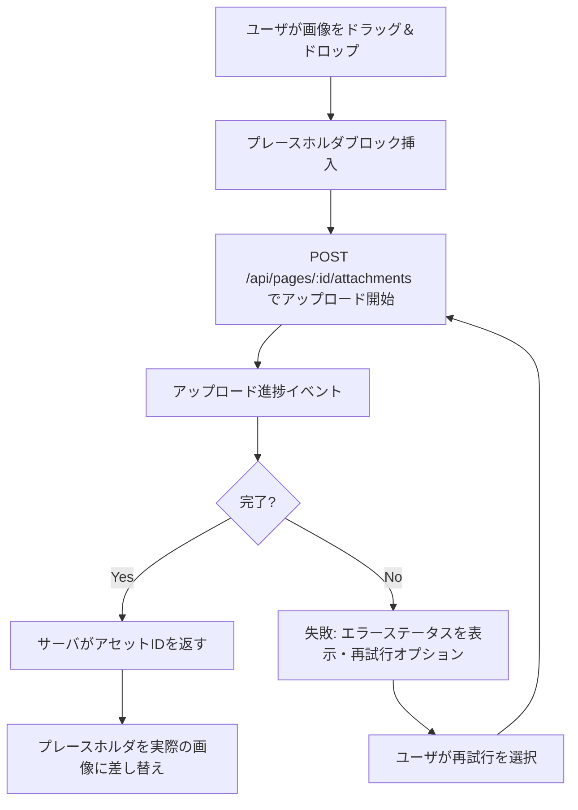
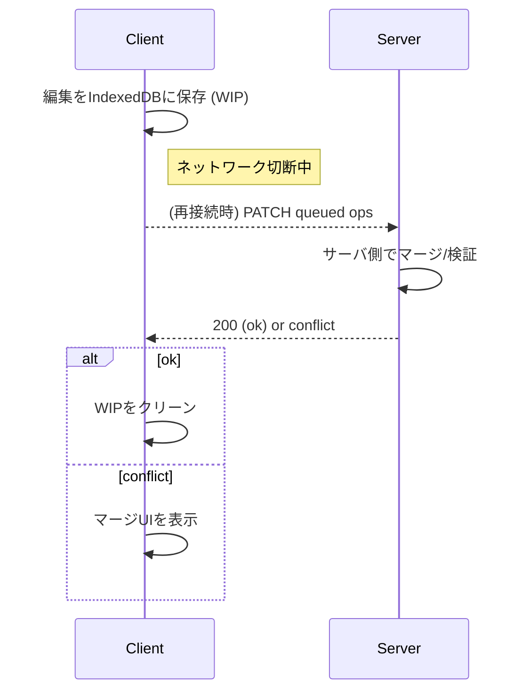
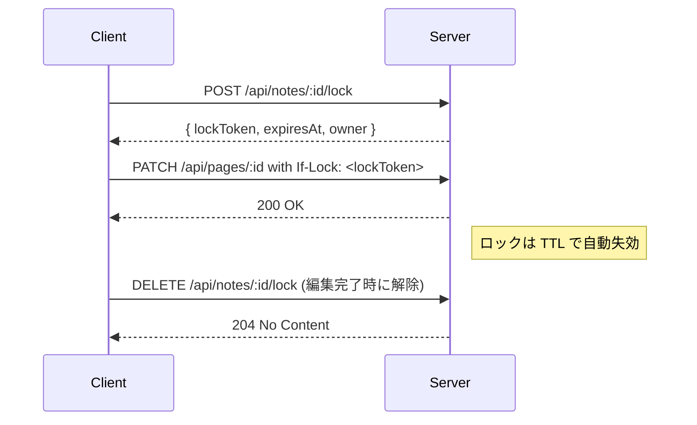

このドキュメントは `docs/specs/markdown-editor-design.md` を参照し、主要な操作フローとエッジケースをMermaidダイアグラムで明確化したものです。

## 自動保存フロー（Flowchart）

```mermaid
flowchart TD
  A[ユーザが入力] --> B[自動保存トリガー (debounce 1s)]
  B --> C[IndexedDB に WIP を保存]
  C --> D{ネットワーク接続あり?}
  D -- Yes --> E{ロック保有?}
  E -- Yes --> F[PATCH /api/pages/:id を送信 (contentBlocks)]
  E -- No --> G[POST /api/notes/:id/lock を試行]
  G -- success --> F
  G -- failure --> H[UI: 誰か編集中の通知・読み取り専用表示]
  F --> I{サーバ応答}
  I -- 200/ok --> J[revisionId 更新・UI: 保存済み]
  I -- 409/conflict --> K[差分確認・手動マージUIを提示]
  I -- 5xx/timeout --> L[再試行 (指数バックオフ)]
  D -- No --> M[オフラインキューへ登録・UI: オフライン保存]
  L --> C
```

## 画像・アタッチメントアップロードフロー



## オフライン復旧シーケンス（Sequence Diagram）



## ロック取得シーケンス（排他制御）



## 競合検出とマージフロー

```mermaid
flowchart TD
  A[サーバが conflict を返す] --> B[自動マージ試行]
  B --> C{自動マージ成功?}
  C -- Yes --> D[結果をクライアントに返す・UIで確認ボタン]
  C -- No --> E[手動マージUI: 左(A)/右(B)/統合(両方)を提示]
  E --> F[ユーザが選択してマージを確定]
  F --> G[PATCH を再送信・コミット]
```

## 注意事項・受け入れ条件

- 各フローはモバイル/デスクトップ問わず一貫した通知UIを持つこと。
- 自動保存はメインスレッドをブロックせず、IndexedDB を利用すること。
- 競合発生時は「自動でデータを破壊しない」ことを最優先とし、ユーザの確認を得るUIを必須とする。

---

Generated: 2026-02-19
